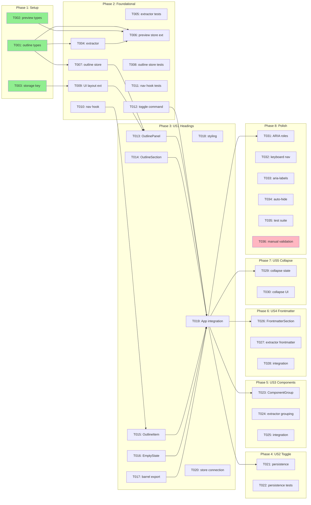

# Tasks: MDX Content Outline/Navigator

**Feature**: `.specify/specs/007-mdx-content-outline/`
**Generated**: 2026-01-17
**Orchestration**: enabled

## Prerequisites

| Document | Status | Purpose |
|----------|--------|---------|
| plan.md | ✅ Available | Tech stack, structure, dependencies |
| spec.md | ✅ Available | User stories with priorities |
| data-model.md | ✅ Available | Entity definitions |
| contracts/ | ✅ Available | TypeScript interfaces |
| research.md | ✅ Available | Technical decisions |
| quickstart.md | ✅ Available | Validation scenarios |

---

## Execution Constraints

```yaml
# Claude Code MAXIMUM POWER Config (Jan 2026 - Claude Max 20x)
# ⚡ SINGLE SESSION FULL THROTTLE - Token cost is not a concern ⚡

model: opus-4.5                    # Most capable model
max_parallel_subagents: 10         # Hard cap enforced by Claude Code
queue_overflow: true               # Tasks beyond 10 auto-queue

# Async/Background Agents (v2.0.60+)
async_background:
  enabled: true
  hotkey: Ctrl+B
  wake_on_complete: true
  background_research: true

# Timeouts (generous for Opus deep reasoning)
default_task_timeout: 10m
gate_timeout: 2m
subagent_timeout: 15m

# Fault Tolerance
circuit_breaker:
  max_failures_per_batch: 5
  action: pause_and_report
retry_policy:
  max_attempts: 3
  backoff: exponential

# Subagent Dispatch Strategy
subagent_dispatch:
  strategy: greedy_queue
  refill_on_complete: true
  context_per_agent: 200k
  extended_thinking: true
  ultrathink: complex
```

---

## Quick Start

### Sequential Execution (Simple)

Execute tasks in order: T001 → T002 → T003 → ...

### Parallel Execution (Recommended) ⚡

1. **Greedy dispatch**: Spawn subagents for ALL tasks in current batch simultaneously
2. **Stream completions**: Process results as each subagent finishes
3. **Gate on batch complete**: Only run validation after ALL batch tasks finish
4. **Cascade immediately**: Start next batch's tasks the instant gate passes

---

## Phase 1: Setup

**Purpose**: Shared type definitions and store extensions
**Max Parallelism**: 3 subagents

### Batch 1.1: Shared Types (parallel) ⚡

<!-- Context: plan.md#structure, contracts/outline-store.ts -->
- [ ] T001 [P:1.1] Create shared outline types in `src/shared/types/outline.ts` exporting OutlineAST, HeadingNode, ComponentNode, FrontmatterData, SourcePosition from contracts
- [ ] T002 [P:1.1] Extend preview types in `src/shared/types/preview.ts` to add `outline: OutlineAST | null` field to CompileSuccess interface
- [ ] T003 [P:1.1] Add outline storage key constant to `src/shared/types/commands.ts` as `'mdxpad:ui:outline-visible'`

#### Gate 1.1: Types Validation

```bash
npx tsc --noEmit src/shared/types/outline.ts src/shared/types/preview.ts src/shared/types/commands.ts
```

**On-Fail**: Check contracts/outline-store.ts for correct type definitions; verify imports

---

## Phase 2: Foundational

**Purpose**: Core infrastructure - stores and extraction logic
**Max Parallelism**: 4 subagents

⚠️ **BLOCKING**: No UI work can begin until this phase completes

### Batch 2.1: AST Extraction (parallel) ⚡

<!-- Context: plan.md#structure, research.md#R5, data-model.md#OutlineAST -->
- [ ] T004 [P:2.1] Create outline extractor in `src/renderer/lib/mdx/outline-extractor.ts` implementing `extractOutline(tree: Root): OutlineAST` using unist-util-visit to extract headings and JSX components
- [ ] T005 [P:2.1] Create outline extractor tests in `src/renderer/lib/mdx/outline-extractor.test.ts` covering heading extraction, component extraction, frontmatter extraction, and empty document handling

#### Gate 2.1: Extractor Validation

```bash
npx tsc --noEmit src/renderer/lib/mdx/outline-extractor.ts && npx vitest run src/renderer/lib/mdx/outline-extractor.test.ts --reporter=verbose
```

**On-Fail**: Verify unist-util-visit import; check data-model.md HeadingNode/ComponentNode definitions

### Batch 2.2: Store Extensions (parallel) ⚡

<!-- Context: plan.md#structure, research.md#R1, research.md#R3, ui-layout-store.ts patterns -->
- [ ] T006 [P:2.2] Extend preview store in `src/renderer/stores/preview-store.ts` to include outline AST in CompileSuccess result and add `selectOutlineAST` selector
- [ ] T007 [P:2.2] Create outline store in `src/renderer/stores/outline-store.ts` implementing OutlineStore interface with updateFromAST, setIsParsing, setParseError, toggleSectionCollapse, toggleItemCollapse, reset actions
- [ ] T008 [P:2.2] Create outline store tests in `src/renderer/stores/outline-store.test.ts` covering updateFromAST with headings/components/frontmatter, section collapse, item collapse, error handling
- [ ] T009 [P:2.2] Extend UI layout store in `src/renderer/stores/ui-layout-store.ts` to add outlineVisible state, toggleOutline/setOutlineVisible actions, selectOutlineVisible selector, and localStorage persistence

#### Gate 2.2: Stores Validation

```bash
npx tsc --noEmit src/renderer/stores/preview-store.ts src/renderer/stores/outline-store.ts src/renderer/stores/ui-layout-store.ts && npx vitest run src/renderer/stores/outline-store.test.ts --reporter=verbose
```

**On-Fail**: Check contracts/outline-store.ts for interface definitions; verify Zustand/Immer patterns match existing stores

### Batch 2.3: Navigation Hook (sequential)

<!-- Context: plan.md#structure, research.md#R2, contracts/outline-navigation.ts, useErrorNavigation.ts -->
- [ ] T010 [P:2.3] Create outline navigation hook in `src/renderer/hooks/useOutlineNavigation.ts` implementing navigateToItem with cursor positioning, scroll-to-center, and line highlighting using CodeMirror StateEffect and Decoration
- [ ] T011 [P:2.3] Create outline navigation tests in `src/renderer/hooks/useOutlineNavigation.test.ts` covering navigation to valid/invalid lines, line highlighting duration, and edge cases

#### Gate 2.3: Navigation Validation

```bash
npx tsc --noEmit src/renderer/hooks/useOutlineNavigation.ts && npx vitest run src/renderer/hooks/useOutlineNavigation.test.ts --reporter=verbose
```

**On-Fail**: Check useErrorNavigation.ts for positioning patterns; verify CodeMirror imports

### Batch 2.4: Command Registration

<!-- Context: plan.md#structure, research.md#R4, view-commands.ts -->
- [ ] T012 [P:2.4] Add toggle-outline command in `src/renderer/commands/view-commands.ts` with id 'view.toggle-outline', shortcut Cmd+Shift+O, calling useUILayoutStore.getState().toggleOutline()

#### Gate 2.4: Commands Validation

```bash
npx tsc --noEmit src/renderer/commands/view-commands.ts
```

**On-Fail**: Verify command ID format matches existing commands; check shortcut conflicts

**✓ Checkpoint**: Foundation ready — UI component implementation can begin

---

## Phase 3: User Story 1 — Navigate Document via Headings (Priority: P1) 🎯 MVP

**Goal**: Heading navigation working with click-to-navigate functionality
**Independent Test**: Click any heading in outline, verify cursor jumps to that line with brief highlight
**Max Parallelism**: 4 subagents

### Batch 3.1: Core Components (parallel) ⚡

<!-- Context: plan.md#structure, contracts/outline-panel.ts, quickstart.md#Step7 -->
- [ ] T013 [P:3.1] [US1] Create OutlinePanel component in `src/renderer/components/outline/OutlinePanel.tsx` with header, close button, section list, and visibility controlled by useUILayoutStore
- [ ] T014 [P:3.1] [US1] Create OutlineSection component in `src/renderer/components/outline/OutlineSection.tsx` with collapsible header, item list, and collapse toggle
- [ ] T015 [P:3.1] [US1] Create OutlineItem component in `src/renderer/components/outline/OutlineItem.tsx` as recursive tree item with click handler, indentation, and optional collapse toggle for headings with children
- [ ] T016 [P:3.1] [US1] Create OutlineEmptyState component in `src/renderer/components/outline/OutlineEmptyState.tsx` showing message when no outline content available

#### Gate 3.1: Components Validation

```bash
npx tsc --noEmit src/renderer/components/outline/*.tsx
```

**On-Fail**: Check contracts/outline-panel.ts for prop definitions; verify imports from stores

### Batch 3.2: Barrel Export and Styling (parallel) ⚡

<!-- Context: plan.md#structure, existing component patterns -->
- [ ] T017 [P:3.2] [US1] Create barrel export in `src/renderer/components/outline/index.ts` exporting OutlinePanel, OutlineSection, OutlineItem, OutlineEmptyState
- [ ] T018 [P:3.2] [US1] Add Tailwind CSS styles for outline components including panel layout (w-[250px] min-w-[150px]), item hover states, indentation, truncation, and highlight animation

#### Gate 3.2: Export Validation

```bash
npx tsc --noEmit src/renderer/components/outline/index.ts
```

**On-Fail**: Verify all components are exported correctly

### Batch 3.3: Integration (sequential)

<!-- Context: plan.md#structure, quickstart.md#Step8, App.tsx -->
- [ ] T019 [P:3.3] [US1] Integrate OutlinePanel into App.tsx layout, positioning it on the left side of the main content area
- [ ] T020 [P:3.3] [US1] Connect outline store to preview store by subscribing to AST changes in App.tsx or a dedicated hook, calling updateFromAST when preview compilation succeeds

#### Gate 3.3: Integration Validation

```bash
npx tsc --noEmit src/renderer/App.tsx && npm run build
```

**On-Fail**: Check import paths; verify store subscriptions work correctly

**✓ Checkpoint**: User Story 1 complete — heading navigation functional

---

## Phase 4: User Story 2 — Toggle Outline Panel Visibility (Priority: P1)

**Goal**: Keyboard shortcut and persistence working
**Independent Test**: Press Cmd+Shift+O, verify panel toggles; restart app, verify state persists
**Max Parallelism**: 2 subagents

### Batch 4.1: Persistence (parallel) ⚡

<!-- Context: ui-layout-store.ts persistence patterns -->
- [ ] T021 [P:4.1] [US2] Add outline visibility to loadFromStorage and persist methods in `src/renderer/stores/ui-layout-store.ts` using localStorage key 'mdxpad:ui:outline-visible'
- [ ] T022 [P:4.1] [US2] Add UI layout store tests for outline visibility in `src/renderer/stores/ui-layout-store.test.ts` covering toggle, persistence load/save, and default value

#### Gate 4.1: Persistence Validation

```bash
npx vitest run src/renderer/stores/ui-layout-store.test.ts --reporter=verbose
```

**On-Fail**: Check localStorage mock in tests; verify storage key constant

**✓ Checkpoint**: User Story 2 complete — toggle and persistence functional

---

## Phase 5: User Story 3 — View Component Usage (Priority: P2)

**Goal**: Components section showing JSX component usage with grouping
**Independent Test**: Create document with JSX components, verify they appear grouped in outline
**Max Parallelism**: 2 subagents

### Batch 5.1: Component Section (parallel) ⚡

<!-- Context: data-model.md#ComponentInfo, contracts/outline-panel.ts#ComponentGroupProps -->
- [ ] T023 [P:5.1] [US3] Create ComponentGroup component in `src/renderer/components/outline/ComponentGroup.tsx` showing component name, count, built-in/custom badge, and expandable instance list
- [ ] T024 [P:5.1] [US3] Update outline-extractor.ts to group components by name, count instances, and mark built-in components per BUILTIN_COMPONENTS constant

#### Gate 5.1: Component Section Validation

```bash
npx tsc --noEmit src/renderer/components/outline/ComponentGroup.tsx src/renderer/lib/mdx/outline-extractor.ts
```

**On-Fail**: Check BUILTIN_COMPONENTS set in contracts; verify grouping logic

### Batch 5.2: Integration

- [ ] T025 [P:5.2] [US3] Integrate ComponentGroup into OutlineSection for components section, connecting click to navigateToItem

#### Gate 5.2: Component Integration Validation

```bash
npx tsc --noEmit src/renderer/components/outline/OutlineSection.tsx && npm run build
```

**On-Fail**: Verify ComponentGroup props match OutlineSectionProps

**✓ Checkpoint**: User Story 3 complete — component navigation functional

---

## Phase 6: User Story 4 — View Frontmatter Summary (Priority: P2)

**Goal**: Frontmatter section showing key metadata fields
**Independent Test**: Create document with YAML frontmatter, verify fields appear in outline
**Max Parallelism**: 2 subagents

### Batch 6.1: Frontmatter Section (parallel) ⚡

<!-- Context: data-model.md#FrontmatterInfo, contracts/outline-panel.ts#FrontmatterSectionProps -->
- [ ] T026 [P:6.1] [US4] Create FrontmatterSection component in `src/renderer/components/outline/FrontmatterSection.tsx` showing title, date, author, tags by default with "Show all" expansion
- [ ] T027 [P:6.1] [US4] Update outline-extractor.ts to parse frontmatter fields, prioritizing DEFAULT_FRONTMATTER_FIELDS and sorting others

#### Gate 6.1: Frontmatter Section Validation

```bash
npx tsc --noEmit src/renderer/components/outline/FrontmatterSection.tsx src/renderer/lib/mdx/outline-extractor.ts
```

**On-Fail**: Check DEFAULT_FRONTMATTER_FIELDS constant; verify yaml parsing

### Batch 6.2: Integration

- [ ] T028 [P:6.2] [US4] Integrate FrontmatterSection into OutlineSection for frontmatter section, connecting click to navigate to line 1

#### Gate 6.2: Frontmatter Integration Validation

```bash
npx tsc --noEmit src/renderer/components/outline/OutlineSection.tsx && npm run build
```

**On-Fail**: Verify FrontmatterSection props; check navigation to line 1

**✓ Checkpoint**: User Story 4 complete — frontmatter navigation functional

---

## Phase 7: User Story 5 — Collapse/Expand Outline Sections (Priority: P3)

**Goal**: Section and heading collapse working with session persistence
**Independent Test**: Collapse sections/headings, edit document, verify collapse state preserved
**Max Parallelism**: 2 subagents

### Batch 7.1: Collapse State (parallel) ⚡

<!-- Context: contracts/outline-store.ts#toggleSectionCollapse, contracts/outline-store.ts#toggleItemCollapse -->
- [ ] T029 [P:7.1] [US5] Implement heading collapse state in outline-store.ts tracking collapsed item IDs in a Set, preserving across AST updates
- [ ] T030 [P:7.1] [US5] Update OutlineItem to show collapse toggle for headings with children, connecting to toggleItemCollapse action

#### Gate 7.1: Collapse State Validation

```bash
npx tsc --noEmit src/renderer/stores/outline-store.ts src/renderer/components/outline/OutlineItem.tsx
```

**On-Fail**: Verify collapsedItems Set logic; check toggle handler wiring

**✓ Checkpoint**: User Story 5 complete — collapse functionality working

---

## Phase 8: Polish & Accessibility

**Purpose**: Accessibility, keyboard navigation, and auto-hide behavior
**Max Parallelism**: 3 subagents

### Batch 8.1: Accessibility (parallel) ⚡

<!-- Context: contracts/outline-panel.ts#ARIA_ROLES, contracts/outline-panel.ts#NAV_KEYS -->
- [ ] T031 [P:8.1] Add ARIA roles to OutlinePanel (role="complementary"), OutlineSection (role="tree"), OutlineItem (role="treeitem") with aria-expanded for collapsible items
- [ ] T032 [P:8.1] Implement keyboard navigation in OutlinePanel using arrow keys (up/down to move, left/right to collapse/expand, Enter to navigate)
- [ ] T033 [P:8.1] Add aria-labels for screen readers: "Document outline", "Headings section", "Components section", "Frontmatter section"

#### Gate 8.1: Accessibility Validation

```bash
npx tsc --noEmit src/renderer/components/outline/*.tsx
```

**On-Fail**: Check NAV_KEYS constants; verify keyboard event handling

### Batch 8.2: Auto-Hide Behavior

<!-- Context: contracts/outline-panel.ts#AUTO_HIDE_THRESHOLD_WITH_PREVIEW -->
- [ ] T034 [P:8.2] Implement auto-hide logic in OutlinePanel responding to window width, hiding below 600px with preview visible or 400px without, auto-restoring when window widens

#### Gate 8.2: Auto-Hide Validation

```bash
npx tsc --noEmit src/renderer/components/outline/OutlinePanel.tsx
```

**On-Fail**: Verify window resize listener; check threshold constants

### Batch 8.3: Final Validation

- [ ] T035 [P:8.3] Run full test suite and fix any failures
- [ ] T036 [P:8.3] Run quickstart.md validation scenarios manually verifying all 10 checklist items

#### Gate 8.3: Final Validation

```bash
npx vitest run --reporter=verbose && npm run build && npm run lint
```

**On-Fail**: Review test output; check lint errors

**✓ Checkpoint**: Feature complete — all user stories implemented

---

## Dependency Graph



---

## Parallelism Analysis

| Phase | Name | Batches | Tasks | Max Parallel | Critical Path |
|-------|------|---------|-------|--------------|---------------|
| 1 | Setup | 1 | 3 | 3 | T001 |
| 2 | Foundational | 4 | 9 | 4 | T004 → T006 → T010 → T012 |
| 3 | US1 Headings | 3 | 8 | 4 | T013 → T017 → T019 |
| 4 | US2 Toggle | 1 | 2 | 2 | T021 |
| 5 | US3 Components | 2 | 3 | 2 | T023 → T025 |
| 6 | US4 Frontmatter | 2 | 3 | 2 | T026 → T028 |
| 7 | US5 Collapse | 1 | 2 | 2 | T029 |
| 8 | Polish | 3 | 6 | 3 | T031 → T035 |
| **Total** | | **17** | **36** | **10 (cap)** | **8 tasks** |

### Parallelism Metrics

| Metric | Value | Notes |
|--------|-------|-------|
| **Total Tasks** | 36 | Sum of all tasks |
| **Critical Path Length** | 8 | T001 → T004 → T006 → T010 → T015 → T019 → T031 → T035 |
| **Parallelism Factor** | 4.5x | 36 tasks / 8 critical |
| **Max Concurrent Subagents** | 10 | Hard cap per Claude session |
| **Theoretical Speedup** | 4.5x | With unlimited parallelism |
| **Practical Speedup** | 3.5x | With 10 slots + greedy refill |

---

## Implementation Strategy

### MVP First (Recommended)

1. ✅ Complete Phase 1: Setup (types)
2. ✅ Complete Phase 2: Foundational (stores, extraction)
3. ✅ Complete Phase 3: US1 - Heading Navigation (MVP)
4. 🧪 **STOP & VALIDATE**: Test heading navigation works
5. ✅ Complete Phase 4: US2 - Toggle (persistence)
6. 🧪 **STOP & VALIDATE**: Test Cmd+Shift+O works, persists
7. Continue with US3-US5 incrementally
8. Complete Phase 8: Polish & Accessibility

### Incremental Delivery

| Milestone | Phases Complete | Deliverable |
|-----------|-----------------|-------------|
| Foundation | 1, 2 | Stores and extraction ready |
| MVP | 1, 2, 3 | Heading navigation working |
| Beta | 1-6 | All P1/P2 features |
| Release | All | Full feature with accessibility |

---

## Recovery Playbook

### Gate Validation Failure

**Symptoms**: All tasks complete but gate fails

**Recovery**:
1. Read gate error output carefully
2. Common causes:
   - Type errors → run `npx tsc --noEmit` on specific file
   - Import errors → check barrel exports
   - Test failures → review test assertions
3. Fix identified issue
4. Re-run gate only

### Cross-Phase Dependency Error

**Symptoms**: Component can't find store

**Recovery**:
1. Verify Phase 2 gates all passed
2. Check import paths use @/ aliases correctly
3. Verify store is exported from barrel

---

## Notes

- **[P:X.Y]** = Batch identifier; same ID means parallel-safe
- **Gates** = Validation checkpoints; don't skip them
- **Checkpoints** = Safe stopping points; story is complete and testable
- Commit after each gate passes
- Each user story after Phase 2 can work independently
- Test with real MDX documents containing headings, components, and frontmatter
