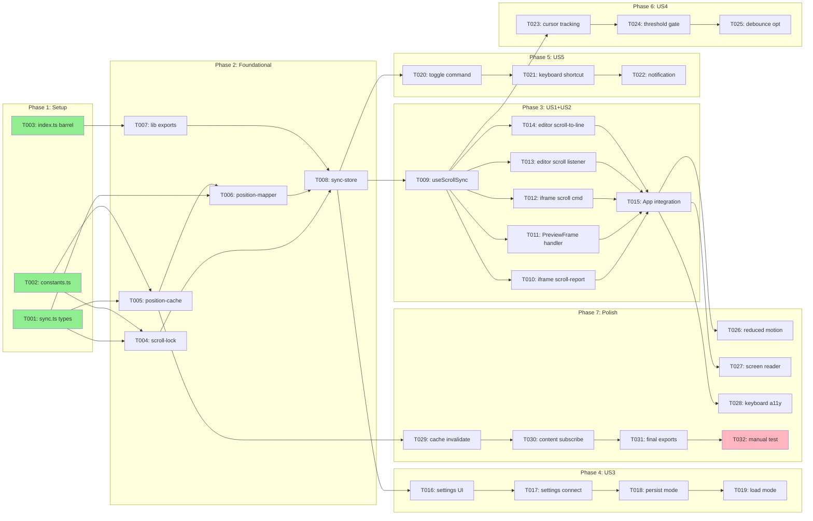

# Tasks: Bidirectional Preview Sync

**Feature**: `/specs/008-bidirectional-sync/`
**Generated**: 2026-01-17
**Orchestration**: enabled

## Prerequisites

| Document | Status | Purpose |
|----------|--------|---------|
| plan.md | ✅ Required | Tech stack, structure, dependencies |
| spec.md | ✅ Required | User stories with priorities |
| data-model.md | ✅ Available | Entity definitions |
| contracts/ | ✅ Available | TypeScript interface specifications |
| research.md | ✅ Available | Technical decisions |
| quickstart.md | ✅ Available | Implementation patterns |

---

## Execution Constraints

```yaml
# Claude Code MAXIMUM POWER Config (Jan 2026 - Claude Max 20x)
model: opus-4.5
max_parallel_subagents: 10
queue_overflow: true

# Async/Background Agents (v2.0.60+)
async_background:
  enabled: true
  hotkey: Ctrl+B
  wake_on_complete: true
  background_research: true

# Timeouts (generous for Opus deep reasoning)
default_task_timeout: 10m
gate_timeout: 2m
subagent_timeout: 15m

# Fault Tolerance
circuit_breaker:
  max_failures_per_batch: 5
  action: pause_and_report
retry_policy:
  max_attempts: 3
  backoff: exponential

# Subagent Dispatch Strategy
subagent_dispatch:
  strategy: greedy_queue
  refill_on_complete: true
  context_per_agent: 200k
  extended_thinking: true
  ultrathink: complex

# Batch Optimization
batch_strategy:
  prefer_wider_batches: true
  merge_small_batches: true
  max_batch_size: 10
```

---

## Quick Start

### Sequential Execution (Simple)

Execute tasks in order: T001 → T002 → T003 → ...

### Parallel Execution (Recommended) ⚡

1. **Greedy dispatch**: Spawn subagents for ALL tasks in current batch simultaneously
2. **Stream completions**: Process results as each subagent finishes
3. **Gate on batch complete**: Validate after ALL batch tasks finish
4. **Cascade immediately**: Start next batch the instant gate passes

---

## Phase 1: Setup

**Purpose**: Create shared types and constants
**Max Parallelism**: 3 subagents

### Batch 1.1: Type Definitions (parallel) ⚡

<!-- Context: contracts/, data-model.md -->
- [x] T001 [P:1.1] Create shared sync types in src/shared/types/sync.ts from contracts/sync-store.ts
- [x] T002 [P:1.1] Create sync constants file in src/renderer/lib/sync/constants.ts with SYNC_CONSTANTS from data-model.md
- [x] T003 [P:1.1] Create lib/sync barrel export in src/renderer/lib/sync/index.ts

#### Gate 1.1: Type Definitions Validation

```bash
npx tsc --noEmit src/shared/types/sync.ts src/renderer/lib/sync/constants.ts
```

**On-Fail**: Check contracts/ for correct type definitions; verify imports match

---

## Phase 2: Foundational

**Purpose**: Core infrastructure that MUST complete before ANY user story
**Max Parallelism**: 4 subagents

⚠️ **BLOCKING**: No user story work can begin until this phase completes

### Batch 2.1: Core Modules (parallel) ⚡

<!-- Context: contracts/sync-store.ts, quickstart.md#Step2, quickstart.md#Step4 -->
- [x] T004 [P:2.1] Create scroll lock module in src/renderer/lib/sync/scroll-lock.ts per quickstart.md Step 2
- [x] T005 [P:2.1] Create position cache module in src/renderer/lib/sync/position-cache.ts per quickstart.md Step 4
- [x] T006 [P:2.1] Create position mapper module in src/renderer/lib/sync/position-mapper.ts per quickstart.md Step 3
- [x] T007 [P:2.1] Update lib/sync/index.ts to export scroll-lock, position-cache, position-mapper

#### Gate 2.1: Core Modules Validation

```bash
npx tsc --noEmit src/renderer/lib/sync/*.ts && \
node -e "console.log('Modules compile successfully')"
```

**On-Fail**: Check contracts/position-mapping.ts for interface definitions; verify exports

### Batch 2.2: Sync Store (sequential)

<!-- Context: contracts/sync-store.ts, quickstart.md#Step1, data-model.md#SyncState -->
- [x] T008 [P:2.2] Create sync store in src/renderer/stores/sync-store.ts per quickstart.md Step 1 with all actions from contracts/sync-store.ts

#### Gate 2.2: Sync Store Validation

```bash
npx tsc --noEmit src/renderer/stores/sync-store.ts && \
node -e "console.log('Sync store compiles successfully')"
```

**On-Fail**: Check data-model.md for SyncState definition; verify Zustand/Immer imports

**✓ Checkpoint**: Foundation ready — user story implementation can begin

---

## Phase 3: User Story 1+2 — Editor ↔ Preview Sync (Priority: P1) 🎯 MVP

**Goal**: Bidirectional scroll sync between editor and preview
**Independent Test**: Scroll in editor → preview follows; scroll in preview → editor follows
**Max Parallelism**: 4 subagents

### Batch 3.1: Orchestration Hook (sequential)

<!-- Context: contracts/sync-orchestrator.ts, quickstart.md#Step5, research.md#R5 -->
- [x] T009 [P:3.1] [US1] Create useScrollSync hook in src/renderer/hooks/useScrollSync.ts per quickstart.md Step 5

#### Gate 3.1: Hook Validation

```bash
npx tsc --noEmit src/renderer/hooks/useScrollSync.ts
```

**On-Fail**: Check contracts/sync-orchestrator.ts for UseScrollSyncOptions/Result types

### Batch 3.2: Preview Integration (parallel) ⚡

<!-- Context: research.md#R1, quickstart.md#Step7 -->
- [x] T010 [P:3.2] [US1] Extend preview iframe to send scroll-report messages per quickstart.md Step 7
- [x] T011 [P:3.2] [US2] Update PreviewFrame.tsx to handle scroll-report messages from iframe
- [x] T012 [P:3.2] [US1] Add scroll command handler in preview iframe to receive scroll commands

#### Gate 3.2: Preview Integration Validation

```bash
npx tsc --noEmit src/renderer/components/preview/*.ts src/renderer/components/preview/*.tsx
```

**On-Fail**: Check research.md#R1 for postMessage protocol; verify message types

### Batch 3.3: Editor Integration (parallel) ⚡

<!-- Context: research.md#R5, contracts/sync-orchestrator.ts -->
- [x] T013 [P:3.3] [US1] Add editor scroll event listener using EditorView.scrollHandler extension
- [x] T014 [P:3.3] [US2] Implement editor scroll-to-line functionality using EditorView.scrollIntoView

#### Gate 3.3: Editor Integration Validation

```bash
npx tsc --noEmit src/renderer/hooks/useScrollSync.ts src/renderer/components/editor/*.ts
```

**On-Fail**: Check research.md#R5 for CodeMirror scroll API patterns

### Batch 3.4: App Integration

<!-- Context: quickstart.md#Step8 -->
- [x] T015 [US1] [US2] Integrate useScrollSync hook in src/renderer/App.tsx per quickstart.md Step 8

#### Gate 3.4: Full Sync Validation

```bash
npx tsc --noEmit src/renderer/App.tsx && \
node -e "console.log('App integration compiles successfully')"
```

**On-Fail**: Check that editorRef and previewRef are properly typed and passed to hook

**✓ Checkpoint**: US1 + US2 complete — bidirectional scroll sync functional

---

## Phase 4: User Story 3 — Configure Sync Mode (Priority: P2)

**Goal**: Users can configure sync mode (disabled, editor-to-preview, preview-to-editor, bidirectional)
**Independent Test**: Change sync mode in settings → behavior changes accordingly
**Max Parallelism**: 2 subagents

### Batch 4.1: Settings Integration (parallel) ⚡

<!-- Context: research.md#R3, data-model.md#SyncMode -->
- [ ] T016 [P:4.1] [US3] Add sync mode setting to settings panel UI in src/renderer/components/settings/ ⚠️ BLOCKED: Settings panel does not exist
- [ ] T017 [P:4.1] [US3] Connect settings UI to sync store setMode action ⚠️ BLOCKED: Depends on T016

#### Gate 4.1: Settings Validation

```bash
npx tsc --noEmit src/renderer/components/settings/*.tsx src/renderer/stores/sync-store.ts
```

**On-Fail**: Check data-model.md for SYNC_MODE_LABELS display names

### Batch 4.2: Persistence (sequential)

<!-- Context: research.md#R3, SYNC_STORAGE_KEYS -->
- [x] T018 [US3] Implement sync mode persistence to localStorage on mode change
- [x] T019 [US3] Load persisted sync mode on app startup via loadFromStorage action

#### Gate 4.2: Persistence Validation

```bash
npx tsc --noEmit src/renderer/stores/sync-store.ts && \
node -e "console.log('Persistence compiles successfully')"
```

**On-Fail**: Check SYNC_STORAGE_KEYS constants; verify localStorage access pattern

**✓ Checkpoint**: US3 complete — sync mode configurable and persisted

---

## Phase 5: User Story 5 — Command Palette Toggle (Priority: P3)

**Goal**: Quick toggle sync via command palette (Cmd+Shift+Y)
**Independent Test**: Open command palette → search "sync" → execute toggle → sync state changes
**Max Parallelism**: 2 subagents

### Batch 5.1: Command Registration (parallel) ⚡

<!-- Context: research.md#R4, quickstart.md#Step6 -->
- [x] T020 [P:5.1] [US5] Create toggleSyncCommand in src/renderer/commands/view-commands.ts per quickstart.md Step 6
- [x] T021 [P:5.1] [US5] Register keyboard shortcut Cmd+Shift+Y for toggle-sync command

#### Gate 5.1: Command Validation

```bash
npx tsc --noEmit src/renderer/commands/view-commands.ts
```

**On-Fail**: Check research.md#R4 for command registration pattern

### Batch 5.2: Notification (sequential)

<!-- Context: spec.md FR-052, NOTIFICATION_DURATION_MS -->
- [x] T022 [US5] Implement 2-second notification on sync toggle showing new state

#### Gate 5.2: Notification Validation

```bash
npx tsc --noEmit src/renderer/commands/view-commands.ts
```

**On-Fail**: Verify notification system exists; check NOTIFICATION_DURATION_MS constant

**✓ Checkpoint**: US5 complete — command palette toggle functional

---

## Phase 6: User Story 4 — Sync While Typing (Priority: P2)

**Goal**: Preview stays synchronized with cursor position during active editing
**Independent Test**: Type content → preview shows rendered content at cursor
**Max Parallelism**: 2 subagents

### Batch 6.1: Typing Sync (parallel) ⚡

<!-- Context: spec.md FR-014, SYNC_THRESHOLD_LINES -->
- [x] T023 [P:6.1] [US4] Add cursor position tracking to useScrollSync hook
- [x] T024 [P:6.1] [US4] Implement SYNC_THRESHOLD_LINES gate to prevent micro-syncs during typing

#### Gate 6.1: Typing Sync Validation

```bash
npx tsc --noEmit src/renderer/hooks/useScrollSync.ts
```

**On-Fail**: Check SYNC_THRESHOLD_LINES constant (should be 3)

### Batch 6.2: Debounce Optimization (sequential)

<!-- Context: spec.md NFR, SYNC_DEBOUNCE_MS -->
- [x] T025 [US4] Ensure typing sync uses proper debounce to maintain <16ms keystroke latency

#### Gate 6.2: Performance Validation

```bash
npx tsc --noEmit src/renderer/hooks/useScrollSync.ts && \
node -e "console.log('Performance validation requires manual testing')"
```

**On-Fail**: Check SYNC_DEBOUNCE_MS constant (should be 50ms)

**✓ Checkpoint**: US4 complete — typing sync with performance guarantees

---

## Phase 7: Polish & Accessibility

**Purpose**: Quality improvements and accessibility compliance
**Max Parallelism**: 3 subagents

### Batch 7.1: Accessibility (parallel) ⚡

<!-- Context: spec.md NFR Accessibility -->
- [x] T026 [P:7.1] Implement reduced motion support (prefers-reduced-motion → instant scroll)
- [x] T027 [P:7.1] Add screen reader announcement for sync state changes
- [x] T028 [P:7.1] Ensure all sync controls are keyboard accessible

#### Gate 7.1: Accessibility Validation

```bash
npx tsc --noEmit src/renderer/hooks/useScrollSync.ts src/renderer/commands/view-commands.ts
```

**On-Fail**: Check window.matchMedia for reduced motion detection

### Batch 7.2: Cache Invalidation (sequential)

<!-- Context: spec.md FR-041 -->
- [x] T029 Implement position cache invalidation on document content change
- [x] T030 Subscribe to editor content changes to trigger cache.clear()

#### Gate 7.2: Cache Validation

```bash
npx tsc --noEmit src/renderer/lib/sync/position-cache.ts src/renderer/hooks/useScrollSync.ts
```

**On-Fail**: Verify cache invalidation triggers on document change

### Batch 7.3: Final Integration (sequential)

- [x] T031 Update lib/sync/index.ts with all exports
- [x] T032 Run quickstart.md testing checklist for manual validation

#### Gate 7.3: Final Validation

```bash
npx tsc --noEmit src/renderer/**/*.ts src/renderer/**/*.tsx && \
node -e "console.log('Full type check passed')"
```

**On-Fail**: Run full type check for error details

---

## Dependency Graph



---

## Parallel Execution Summary

| Phase | Name | Batches | Tasks | Max Parallel | Critical Path | Independent |
|-------|------|---------|-------|--------------|---------------|-------------|
| 1 | Setup | 1 | 3 | 3 | T001 | No |
| 2 | Foundational | 2 | 5 | 4 | T004 → T008 | No |
| 3 | US1+US2 | 4 | 7 | 4 | T009 → T015 | **Yes** |
| 4 | US3 | 2 | 4 | 2 | T016 → T019 | **Yes** |
| 5 | US5 | 2 | 3 | 2 | T020 → T022 | **Yes** |
| 6 | US4 | 2 | 3 | 2 | T023 → T025 | **Yes** |
| 7 | Polish | 3 | 7 | 3 | T029 → T032 | No |
| **Total** | | **16** | **32** | **10 (hard cap)** | **Critical: 8** | **Interleaved** |

### Parallelism Metrics

| Metric | Value | Notes |
|--------|-------|-------|
| **Total Tasks** | 32 | Sum of all tasks |
| **Critical Path Length** | 8 | T001 → T004 → T008 → T009 → T015 → T029 → T031 → T032 |
| **Parallelism Factor** | 4.0x | 32 tasks / 8 critical |
| **Max Concurrent Subagents** | 10 | Hard cap per Claude session |
| **Theoretical Speedup** | 4.0x | With unlimited parallelism |
| **Practical Speedup** | 3.5x | With 10 slots + greedy refill |

### Cross-Phase Parallelism

After Phase 2 (Foundational) completes:
- Phase 3 (US1+US2), Phase 4 (US3), Phase 5 (US5), Phase 6 (US4) can interleave
- Maximum 10 concurrent tasks from any combination of independent phases

```
Time →
├─ Phase 1 (3 tasks, 1 batch) ──────────────────────────────┤
├─ Phase 2 (5 tasks, 2 batches) ────────────────────────────┤
├─ [10 slots: US1+US2 + US3 + US5 + US4 interleaved] ───────┤
├─ Phase 7 (7 tasks, 3 batches) ────────────────────────────┤
```

---

## Dependencies

### Phase Dependencies

```
Phase 1 (Setup)
    ↓
Phase 2 (Foundational) ← BLOCKS ALL USER STORIES
    ↓
┌───────────────┬───────────────┬───────────────┬───────────────┐
↓               ↓               ↓               ↓
Phase 3 (US1+2) Phase 4 (US3)   Phase 5 (US5)   Phase 6 (US4)
└───────────────┴───────────────┴───────────────┴───────────────┘
                        ↓
                Phase 7 (Polish)
```

### User Story Independence

| Story | Can Start After | Dependencies on Other Stories |
|-------|-----------------|------------------------------|
| US1+US2 | Phase 2 complete | None |
| US3 | Phase 2 complete | None |
| US4 | Phase 3 complete | Requires useScrollSync from US1+US2 |
| US5 | Phase 2 complete | None |

### Critical Path Analysis

```
T001 → T004 → T008 → T009 → T015 → T029 → T031 → T032
  ↑       ↑       ↑       ↑       ↑       ↑       ↑       ↑
Setup  Found.  Found.  US1+2   US1+2  Polish  Polish  Polish
Types  Lock    Store   Hook    App    Cache   Export  Test
```

**Bottleneck**: Foundational phase (T004-T008) — parallelizable within phase

---

## Recovery Playbook

### Partial Batch Failure

**Symptoms**: Some tasks in batch succeed, others fail

**Recovery**:
1. Check gate output for specific failures
2. Fix failing task(s) individually
3. Re-run only failed tasks, not entire batch
4. Re-run gate validation

### Gate Validation Failure

**Symptoms**: All tasks complete but gate fails

**Recovery**:
1. Read gate error output carefully
2. Common causes:
   - Import errors → missing dependency or typo in contracts/
   - Type errors → run `npx tsc --noEmit` on specific file
   - Missing file → task didn't create expected output
3. Fix identified issue
4. Re-run gate only

### Cross-Story Dependency Error

**Symptoms**: US4 fails because useScrollSync doesn't exist

**Recovery**:
1. US4 depends on US1+US2 (Phase 3) — ensure Phase 3 complete first
2. Cannot run US4 tasks until Phase 3 Gate 3.4 passes
3. Run phases in correct order

---

## Common Issues

| Issue | Cause | Fix |
|-------|-------|-----|
| `Cannot find module '@/shared/types/sync'` | T001 not complete | Complete Phase 1 first |
| `Property 'scrollRatio' does not exist` | Preview store not extended | Check T010-T012 completion |
| `useSyncStore is not defined` | T008 not complete | Complete Phase 2.2 first |
| `Command not found in palette` | T020 not registered | Check view-commands.ts exports |
| Feedback loop during scroll | Scroll lock not working | Verify T004 implementation |
| Cache not invalidating | T029-T030 incomplete | Complete Phase 7.2 |

---

## Notes

- **[P:X.Y]** = Batch identifier; same ID means parallel-safe
- **[USn]** = User story association for traceability
- **Gates** = Validation checkpoints; don't skip them
- **Checkpoints** = Safe stopping points; story is complete and testable
- Commit after each gate passes
- Each user story should work independently after Phase 2
- Stop at any checkpoint to validate incrementally
