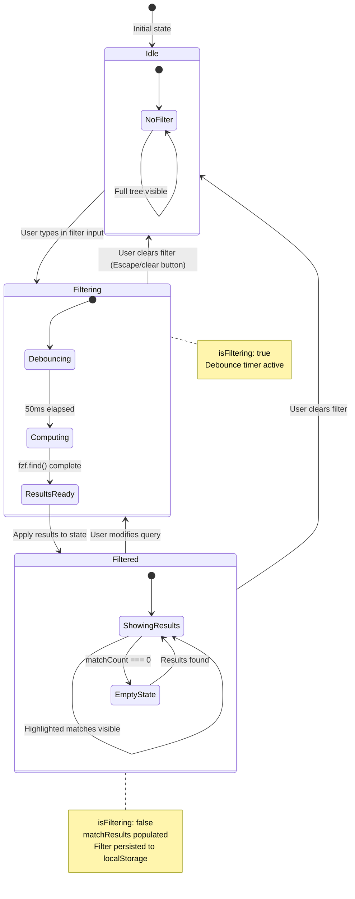

# Data Model: Smart Filtering for File Tree

**Branch**: `014-smart-filtering` | **Date**: 2026-01-17
**Spec**: [spec.md](./spec.md) | **Plan**: [plan.md](./plan.md) | **Research**: [research.md](./research.md)

---

## Overview

This document defines the data model for the Smart Filtering feature, including entity definitions, relationships, state management, and persistence patterns. The design follows established Zustand + Immer patterns from the codebase.

---

## 1. Entity Definitions

### 1.1 Filter Query

The text string entered by the user to filter the file tree.

```typescript
/**
 * Filter query state.
 * Represents the current filter input value.
 */
export interface FilterQuery {
  /** The raw filter text entered by the user */
  readonly value: string;
  /** Whether the filter is actively being applied (non-empty value) */
  readonly isActive: boolean;
}

/**
 * Initial filter query state.
 */
export const INITIAL_FILTER_QUERY: FilterQuery = {
  value: '',
  isActive: false,
};
```

### 1.2 Match Result

A file or folder that matches the filter query, including match positions for highlighting.

```typescript
/**
 * Match positions from fzf library.
 * Set of character indices (0-based) that matched the query.
 */
export type MatchPositions = ReadonlySet<number>;

/**
 * Result of matching a single file/folder against the filter query.
 */
export interface MatchResult {
  /** Unique identifier for the file tree node (path-based) */
  readonly nodeId: string;
  /** The match score from fzf (higher = better match) */
  readonly score: number;
  /** Character positions that matched the query (0-based indices) */
  readonly positions: MatchPositions;
  /** Whether this is a direct match (vs ancestor of a match) */
  readonly isDirectMatch: boolean;
}

/**
 * Map of node IDs to their match results.
 * Only contains entries for nodes that matched or are ancestors of matches.
 */
export type MatchResultMap = ReadonlyMap<string, MatchResult>;
```

### 1.3 File Tree Node

A file or folder in the explorer with visibility state determined by filter matches.

```typescript
/**
 * Node type discriminant.
 */
export type FileTreeNodeType = 'file' | 'folder';

/**
 * Visibility state for a file tree node under filtering.
 */
export type FilterVisibility =
  | 'visible'         // Matches query directly or is ancestor of match
  | 'hidden'          // Does not match and has no matching descendants
  | 'ancestor-only';  // Visible only because it contains matching descendants
                      // Visual distinction: ancestor-only nodes do NOT receive highlighting
                      // (no match positions), only direct matches get highlighting

/**
 * File tree node with filter-aware visibility.
 */
export interface FileTreeNode {
  /** Unique identifier (normalized absolute path) */
  readonly id: string;
  /** Display name (filename or folder name) */
  readonly name: string;
  /** Node type */
  readonly type: FileTreeNodeType;
  /** Full path to file/folder */
  readonly path: string;
  /** Parent node ID (null for root) */
  readonly parentId: string | null;
  /** Child node IDs (empty for files) */
  readonly childIds: readonly string[];
  /** Depth level in tree (0 for root children) */
  readonly depth: number;
}

/**
 * Enhanced node with filter metadata.
 * Used during rendering to determine visibility and highlighting.
 */
export interface FilteredFileTreeNode extends FileTreeNode {
  /** Visibility state under current filter */
  readonly visibility: FilterVisibility;
  /** Match result if this node matched directly */
  readonly matchResult: MatchResult | null;
  /** Whether this node should be auto-expanded due to filter */
  readonly shouldAutoExpand: boolean;
}
```

### 1.4 Filter State (Zustand Store)

Complete filter state managed by the file explorer store.

```typescript
/**
 * Filter-specific state slice.
 * Integrated into the file explorer store.
 */
export interface FileTreeFilterState {
  /** Current filter query */
  readonly query: FilterQuery;
  /** Map of node IDs to match results */
  readonly matchResults: MatchResultMap;
  /** Whether filter is currently being computed (debounce pending) */
  readonly isFiltering: boolean;
  /** Total count of directly matching nodes */
  readonly matchCount: number;
  /**
   * Project path for persistence (used to generate storage key).
   * A "project" is defined as the root directory path opened in the file explorer
   * (determined by file-system-shell spec 004). Each unique project path gets
   * its own isolated filter persistence in localStorage.
   */
  readonly projectPath: string | null;
}

/**
 * Initial filter state.
 */
export const INITIAL_FILTER_STATE: FileTreeFilterState = {
  query: INITIAL_FILTER_QUERY,
  matchResults: new Map(),
  isFiltering: false,
  matchCount: 0,
  projectPath: null,
};
```

---

## 2. Store Types

### 2.1 Filter Store Actions

```typescript
/**
 * Filter store actions.
 */
export interface FileTreeFilterActions {
  /**
   * Set the filter query value.
   * Triggers debounced filtering (50ms).
   *
   * @param value - New filter query string
   */
  readonly setFilterQuery: (value: string) => void;

  /**
   * Clear the filter query and restore full tree view.
   */
  readonly clearFilter: () => void;

  /**
   * Apply filter results to state.
   * Called after debounced fzf computation completes.
   *
   * @param results - Map of node IDs to match results
   * @param matchCount - Total count of direct matches
   */
  readonly applyFilterResults: (
    results: MatchResultMap,
    matchCount: number
  ) => void;

  /**
   * Set filtering in-progress state.
   *
   * @param isFiltering - Whether filtering is in progress
   */
  readonly setIsFiltering: (isFiltering: boolean) => void;

  /**
   * Set the current project path (for persistence key).
   * Called when project/workspace changes.
   *
   * @param path - Project root path
   */
  readonly setProjectPath: (path: string) => void;

  /**
   * Load persisted filter query for current project.
   * Called on project open.
   */
  readonly loadPersistedFilter: () => void;

  /**
   * Persist current filter query for current project.
   * Called on filter change (debounced with filter computation).
   */
  readonly persistFilter: () => void;
}
```

### 2.2 Combined Store Type

```typescript
/**
 * Combined file explorer store type with filter support.
 */
export type FileExplorerStore =
  & FileExplorerStoreState
  & FileExplorerStoreActions
  & FileTreeFilterState
  & FileTreeFilterActions;
```

---

## 3. Relationships

### 3.1 Entity Relationship Diagram

```
┌─────────────────────────────────────────────────────────────────────────┐
│                           FILE EXPLORER STORE                          │
├─────────────────────────────────────────────────────────────────────────┤
│                                                                         │
│  ┌──────────────────┐         ┌──────────────────┐                     │
│  │   FilterQuery    │         │  FileTreeNode[]  │                     │
│  │                  │         │                  │                     │
│  │  value: string   │────────▶│  id: string      │                     │
│  │  isActive: bool  │  fzf    │  name: string    │                     │
│  │                  │ match   │  type: file|dir  │                     │
│  └────────┬─────────┘         │  path: string    │                     │
│           │                   │  parentId: str?  │                     │
│           │                   │  childIds: str[] │                     │
│           │                   │  depth: number   │                     │
│           │                   └────────┬─────────┘                     │
│           │                            │                               │
│           │ produces                   │ annotates                     │
│           ▼                            ▼                               │
│  ┌──────────────────┐         ┌──────────────────┐                     │
│  │ MatchResultMap   │────────▶│FilteredFileTree- │                     │
│  │                  │         │      Node        │                     │
│  │  nodeId: string  │         │                  │                     │
│  │  score: number   │         │  + visibility    │                     │
│  │  positions: Set  │         │  + matchResult   │                     │
│  │  isDirectMatch   │         │  + shouldExpand  │                     │
│  └──────────────────┘         └──────────────────┘                     │
│                                                                         │
└─────────────────────────────────────────────────────────────────────────┘
                                      │
                                      │ persists to
                                      ▼
                          ┌──────────────────────┐
                          │     localStorage     │
                          │                      │
                          │  mdxpad:filter:      │
                          │  query:<8-char-hash> │
                          └──────────────────────┘
```

### 3.2 Relationship Descriptions

| Relationship | From | To | Cardinality | Description |
|-------------|------|-----|-------------|-------------|
| Produces | FilterQuery | MatchResultMap | 1:1 | Filter query produces a map of match results via fzf |
| Contains | MatchResultMap | MatchResult | 1:N | Map contains zero or more match results |
| References | MatchResult | FileTreeNode | N:1 | Match result references a file tree node by ID |
| Annotates | MatchResultMap | FilteredFileTreeNode | 1:N | Match results annotate nodes with visibility |
| Persists | FilterQuery | localStorage | 1:1 | Query value persisted per project |

---

## 4. State Flow Diagram



---

## 5. Persistence Model

### 5.1 Storage Key Generation

```typescript
/**
 * Prefix for filter query storage keys.
 */
export const FILTER_STORAGE_KEY_PREFIX = 'mdxpad:filter:query:' as const;

/**
 * Generate a simple 8-character hash for project path.
 * Uses FNV-1a algorithm for consistent, fast hashing.
 *
 * @param str - String to hash (project path)
 * @returns 8-character hexadecimal hash
 */
export function simpleHash(str: string): string {
  let hash = 2166136261; // FNV offset basis
  for (let i = 0; i < str.length; i++) {
    hash ^= str.charCodeAt(i);
    hash = (hash * 16777619) >>> 0; // FNV prime, unsigned
  }
  return hash.toString(16).padStart(8, '0');
}

/**
 * Generate localStorage key for filter query persistence.
 *
 * @param projectPath - Absolute path to project root
 * @returns Storage key in format "mdxpad:filter:query:<8-char-hash>"
 */
export function getFilterStorageKey(projectPath: string): string {
  return `${FILTER_STORAGE_KEY_PREFIX}${simpleHash(projectPath)}`;
}
```

### 5.2 Persistence Behavior

| Event | Action | Notes |
|-------|--------|-------|
| Filter query change | Persist after 50ms debounce | Piggybacks on filter computation debounce |
| Filter cleared | Remove key from localStorage | Don't store empty strings |
| Project opened | Load persisted query | Apply filter immediately if exists |
| Project closed | No action | Query remains in localStorage |
| App restart | Load on project open | Restore previous filter state |

### 5.3 Storage Schema

```typescript
/**
 * Persisted filter data structure.
 * Simple string value, no JSON wrapper needed.
 */
type PersistedFilterQuery = string;

/**
 * Example localStorage entries:
 *
 * Key: "mdxpad:filter:query:a1b2c3d4"
 * Value: "component"
 *
 * Key: "mdxpad:filter:query:e5f6g7h8"
 * Value: "test"
 */
```

### 5.4 Load/Save Functions

```typescript
/**
 * Load persisted filter query for a project.
 * Returns empty string if not found or on error.
 *
 * @param projectPath - Project root path
 * @returns Persisted filter query or empty string
 */
export function loadPersistedFilterQuery(projectPath: string): string {
  try {
    const key = getFilterStorageKey(projectPath);
    return localStorage.getItem(key) ?? '';
  } catch {
    // Silent fail - filter is non-critical
    console.warn('[Filter] Failed to load persisted filter query');
    return '';
  }
}

/**
 * Save filter query for a project.
 * Removes key if query is empty.
 *
 * @param projectPath - Project root path
 * @param query - Filter query to persist
 */
export function saveFilterQuery(projectPath: string, query: string): void {
  try {
    const key = getFilterStorageKey(projectPath);
    if (query.trim() === '') {
      localStorage.removeItem(key);
    } else {
      localStorage.setItem(key, query);
    }
  } catch {
    // Silent fail - filter persistence is non-critical
    console.warn('[Filter] Failed to persist filter query');
  }
}
```

---

## 6. Computed/Derived State

### 6.1 Visibility Computation

```typescript
/**
 * Compute visibility for a file tree node based on match results.
 *
 * @param node - The file tree node
 * @param matchResults - Map of node IDs to match results
 * @param isFilterActive - Whether filter is currently active
 * @returns Visibility state for the node
 */
export function computeNodeVisibility(
  node: FileTreeNode,
  matchResults: MatchResultMap,
  isFilterActive: boolean
): FilterVisibility {
  // No filter active = all visible
  if (!isFilterActive) {
    return 'visible';
  }

  const matchResult = matchResults.get(node.id);

  // Direct match
  if (matchResult?.isDirectMatch) {
    return 'visible';
  }

  // Ancestor of a match (has entry but not direct)
  if (matchResult && !matchResult.isDirectMatch) {
    return 'ancestor-only';
  }

  // No match
  return 'hidden';
}
```

### 6.2 Auto-Expand Logic

```typescript
/**
 * Determine if a folder should auto-expand due to filter.
 * Folders auto-expand when they contain matching descendants.
 *
 * @param node - The folder node
 * @param matchResults - Map of node IDs to match results
 * @returns Whether folder should auto-expand
 */
export function shouldAutoExpand(
  node: FileTreeNode,
  matchResults: MatchResultMap
): boolean {
  if (node.type !== 'folder') {
    return false;
  }

  const matchResult = matchResults.get(node.id);

  // Expand if this folder is an ancestor of a match
  return matchResult !== undefined && !matchResult.isDirectMatch;
}
```

---

## 7. Store Implementation Pattern

Following the established Zustand + Immer pattern from `ui-layout-store.ts`:

```typescript
import { create } from 'zustand';
import { immer } from 'zustand/middleware/immer';
import { enableMapSet } from 'immer';

// Enable Immer's MapSet plugin for Map/Set support
enableMapSet();

/**
 * File explorer store with filter support.
 */
export const useFileExplorerStore = create<FileExplorerStore>()(
  immer((set, get) => ({
    // Initial state
    ...INITIAL_FILTER_STATE,

    // Filter actions
    setFilterQuery: (value: string) => {
      set((draft) => {
        draft.query.value = value;
        draft.query.isActive = value.trim().length > 0;
        draft.isFiltering = true;
      });

      // Debounced filter computation triggered externally
      // (via useEffect in component or dedicated hook)
    },

    clearFilter: () => {
      set((draft) => {
        draft.query = INITIAL_FILTER_QUERY;
        draft.matchResults = new Map();
        draft.matchCount = 0;
        draft.isFiltering = false;
      });

      // Persist cleared state
      const { projectPath } = get();
      if (projectPath) {
        saveFilterQuery(projectPath, '');
      }
    },

    applyFilterResults: (results, matchCount) => {
      set((draft) => {
        draft.matchResults = results;
        draft.matchCount = matchCount;
        draft.isFiltering = false;
      });

      // Persist query
      const { projectPath, query } = get();
      if (projectPath) {
        saveFilterQuery(projectPath, query.value);
      }
    },

    setIsFiltering: (isFiltering) => {
      set((draft) => {
        draft.isFiltering = isFiltering;
      });
    },

    setProjectPath: (path) => {
      set((draft) => {
        draft.projectPath = path;
      });
    },

    loadPersistedFilter: () => {
      const { projectPath } = get();
      if (!projectPath) return;

      const persistedQuery = loadPersistedFilterQuery(projectPath);
      if (persistedQuery) {
        set((draft) => {
          draft.query.value = persistedQuery;
          draft.query.isActive = true;
          draft.isFiltering = true;
        });
        // Trigger filter computation for restored query
      }
    },

    persistFilter: () => {
      const { projectPath, query } = get();
      if (projectPath) {
        saveFilterQuery(projectPath, query.value);
      }
    },
  }))
);
```

---

## 8. Selectors

```typescript
/**
 * Selector for filter query value.
 */
export const selectFilterQuery = (state: FileExplorerStore): string =>
  state.query.value;

/**
 * Selector for filter active state.
 */
export const selectIsFilterActive = (state: FileExplorerStore): boolean =>
  state.query.isActive;

/**
 * Selector for filtering in-progress state.
 */
export const selectIsFiltering = (state: FileExplorerStore): boolean =>
  state.isFiltering;

/**
 * Selector for match count.
 */
export const selectMatchCount = (state: FileExplorerStore): number =>
  state.matchCount;

/**
 * Selector for match results map.
 */
export const selectMatchResults = (state: FileExplorerStore): MatchResultMap =>
  state.matchResults;

/**
 * Selector factory for node match result.
 *
 * @param nodeId - Node ID to get match result for
 * @returns Selector function
 */
export const selectNodeMatchResult = (nodeId: string) =>
  (state: FileExplorerStore): MatchResult | undefined =>
    state.matchResults.get(nodeId);

/**
 * Selector for whether to show empty state.
 */
export const selectShowEmptyState = (state: FileExplorerStore): boolean =>
  state.query.isActive && !state.isFiltering && state.matchCount === 0;
```

---

## 9. Constants

```typescript
/**
 * Filter input debounce delay in milliseconds.
 * Per FR-010: 50ms debounce after last keystroke.
 */
export const FILTER_DEBOUNCE_MS = 50;

/**
 * Maximum filter query length.
 * Prevents excessive computation for very long strings.
 */
export const MAX_FILTER_QUERY_LENGTH = 256;

/**
 * Filter storage key prefix.
 */
export const FILTER_STORAGE_KEY_PREFIX = 'mdxpad:filter:query:' as const;

/**
 * Empty state message when no files match filter.
 */
export const FILTER_EMPTY_STATE_MESSAGE = 'No files match your filter' as const;
```

---

## 10. Type Exports Summary

```typescript
// Core types
export type {
  FilterQuery,
  MatchPositions,
  MatchResult,
  MatchResultMap,
  FileTreeNodeType,
  FilterVisibility,
  FileTreeNode,
  FilteredFileTreeNode,
};

// Store types
export type {
  FileTreeFilterState,
  FileTreeFilterActions,
  FileExplorerStore,
};

// Constants
export {
  INITIAL_FILTER_QUERY,
  INITIAL_FILTER_STATE,
  FILTER_DEBOUNCE_MS,
  MAX_FILTER_QUERY_LENGTH,
  FILTER_STORAGE_KEY_PREFIX,
  FILTER_EMPTY_STATE_MESSAGE,
};

// Utilities
export {
  simpleHash,
  getFilterStorageKey,
  loadPersistedFilterQuery,
  saveFilterQuery,
  computeNodeVisibility,
  shouldAutoExpand,
};

// Selectors
export {
  selectFilterQuery,
  selectIsFilterActive,
  selectIsFiltering,
  selectMatchCount,
  selectMatchResults,
  selectNodeMatchResult,
  selectShowEmptyState,
};
```

---

*Data model completed: 2026-01-17*
