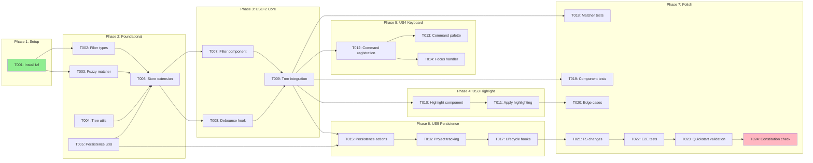

# Tasks: Smart Filtering for File Tree

**Feature**: `/specs/014-smart-filtering/`
**Generated**: 2026-01-17
**Orchestration**: enabled

## Prerequisites

| Document | Status | Purpose |
|----------|--------|---------|
| plan.md | ✅ Present | Tech stack, structure, dependencies |
| spec.md | ✅ Present | User stories with priorities |
| data-model.md | ✅ Present | Entity definitions |
| contracts/ | ✅ Present | Command and schema specifications |
| research.md | ✅ Present | Technical decisions (fzf, keyboard conflict) |
| quickstart.md | ✅ Present | Validation scenarios |

---

## Execution Constraints

```yaml
# Claude Code MAXIMUM POWER Config (Jan 2026 - Claude Max 20x)
model: opus-4.5
max_parallel_subagents: 10
queue_overflow: true

async_background:
  enabled: true
  hotkey: Ctrl+B
  wake_on_complete: true
  background_research: true

default_task_timeout: 10m
gate_timeout: 2m
subagent_timeout: 15m

circuit_breaker:
  max_failures_per_batch: 5
  action: pause_and_report

retry_policy:
  max_attempts: 3
  backoff: exponential

subagent_dispatch:
  strategy: greedy_queue
  refill_on_complete: true
  context_per_agent: 200k
  extended_thinking: true
```

---

## Quick Start

### Sequential Execution (Simple)

Execute tasks T001 → T002 → ... in order. Run gate validation after each batch.

### Parallel Execution (Recommended) ⚡

1. Spawn subagents for ALL tasks in current batch simultaneously
2. Wait for batch completion, run gate validation
3. Cascade to next batch immediately

---

## Phase 1: Setup

**Purpose**: Install fzf dependency
**Estimated Duration**: 5 minutes
**Max Parallelism**: 1 subagent

### Batch 1.1: Dependencies

- [x] T001 [P:1.1] Install fzf package: `npm install fzf`

#### Gate 1.1: Dependency Validation

```bash
test -f package.json && grep -q '"fzf"' package.json
```

**On-Fail**: Verify npm install completed; check package.json for fzf entry

---

## Phase 2: Foundational

**Purpose**: Core types, utilities, and store extension that ALL user stories depend on
**Estimated Duration**: 20-30 minutes
**Max Parallelism**: 4 subagents

⚠️ **BLOCKING**: No user story work can begin until this phase completes

### Batch 2.1: Types & Utilities (parallel) ⚡

<!-- Context: data-model.md, contracts/filter-schemas.ts -->
- [x] T002 [P:2.1] Create filter types in `src/renderer/lib/fuzzy-match/types.ts` per data-model.md (FilterQuery, MatchResult, MatchPositions, FilterVisibility)
- [x] T003 [P:2.1] Create fuzzy matcher wrapper in `src/renderer/lib/fuzzy-match/matcher.ts` using fzf library per research.md
- [x] T004 [P:2.1] Create tree filtering utilities in `src/renderer/lib/file-tree/filter-utils.ts` (computeNodeVisibility, shouldAutoExpand)
- [x] T005 [P:2.1] Create persistence utilities in `src/renderer/lib/fuzzy-match/persistence.ts` (getFilterStorageKey, loadFilterQuery, saveFilterQuery with FNV-1a hash)

#### Gate 2.1: Types & Utilities Validation

```bash
npx tsc --noEmit src/renderer/lib/fuzzy-match/types.ts src/renderer/lib/fuzzy-match/matcher.ts src/renderer/lib/file-tree/filter-utils.ts src/renderer/lib/fuzzy-match/persistence.ts
```

**On-Fail**: Check data-model.md for type definitions; verify fzf import works

### Batch 2.2: Store Extension

<!-- Context: data-model.md#store, existing file-explorer-store.ts -->
- [x] T006 [P:2.2] Extend `src/renderer/stores/file-explorer-store.ts` with filter state slice (FileTreeFilterState, FileTreeFilterActions) per data-model.md Section 7

#### Gate 2.2: Store Validation

```bash
npx tsc --noEmit src/renderer/stores/file-explorer-store.ts
```

**On-Fail**: Verify Immer MapSet plugin enabled; check action signatures match data-model.md

**✓ Checkpoint**: Foundation ready — user story implementation can begin

---

## Phase 3: User Story 1+2 — Core Filtering & Fuzzy Matching (Priority: P1) 🎯 MVP

**Goal**: Implement filter input that filters file tree using fzf-style fuzzy matching
**Independent Test**: Type a query → only matching files shown, fuzzy patterns work
**Estimated Duration**: 25-35 minutes
**Max Parallelism**: 3 subagents

**Note**: US1 and US2 are merged because fuzzy matching is integral to the filtering feature.

### Batch 3.1: Filter Component (parallel) ⚡

<!-- Context: plan.md#components, data-model.md, quickstart.md#usage -->
- [x] T007 [P:3.1] [US1] Create `src/renderer/components/file-explorer/FileTreeFilter.tsx` - filter input component with:
  - Text input with placeholder "Filter files..."
  - 50ms debounced onChange per FR-010
  - Clear button (X icon) when query non-empty
  - Escape key handling (clear first, then blur)
  - Connect to store actions (setFilterQuery, clearFilter)
- [x] T008 [P:3.1] [US1] Create debounce hook `src/renderer/hooks/useFilterDebounce.ts` - 50ms debounce for filter input per FR-010

#### Gate 3.1: Component Validation

```bash
npx tsc --noEmit src/renderer/components/file-explorer/FileTreeFilter.tsx src/renderer/hooks/useFilterDebounce.ts
```

**On-Fail**: Check store imports; verify React 19 compatibility

### Batch 3.2: File Tree Integration

<!-- Context: existing FileExplorer.tsx, store selectors -->
<!-- NOTE: FileExplorer.tsx doesn't exist yet - depends on spec 003/004 file system shell -->
- [ ] T009 [P:3.2] [US1] Integrate filter into file tree rendering in existing `src/renderer/components/file-explorer/FileExplorer.tsx`:
  - Add FileTreeFilter component above tree
  - Filter visible nodes based on matchResults
  - Auto-expand folders with matching descendants
  - Show empty state when no matches (FR-011)
  - Maintain tree structure with ancestor nodes visible (FR-004)

#### Gate 3.2: Integration Validation

```bash
npx tsc --noEmit src/renderer/components/file-explorer/FileExplorer.tsx
```

**On-Fail**: Verify store selectors work; check visibility computation logic

**✓ Checkpoint**: User Story 1+2 complete — filtering with fuzzy matching works

---

## Phase 4: User Story 3 — Visual Match Highlighting (Priority: P2)

**Goal**: Highlight matched character positions in file/folder names
**Independent Test**: Type query → matched characters visually distinguished
**Estimated Duration**: 15-20 minutes
**Max Parallelism**: 2 subagents

### Batch 4.1: Highlight Component

<!-- Context: contracts/filter-schemas.ts#positionsToSegments, quickstart.md#highlighting -->
- [x] T010 [P:4.1] [US3] Create `src/renderer/components/file-explorer/FilterHighlight.tsx`:
  - Accept text and positions (Set<number>) as props
  - Split text into matched/unmatched segments using positionsToSegments
  - Render matched chars with CSS class `filter-match`
  - Style: font-weight: 600, text-decoration: underline (per Constitution VII.2 - color not sole indicator)

### Batch 4.2: Apply Highlighting

<!-- Context: FileExplorer.tsx, existing file/folder name rendering -->
- [ ] T011 [P:4.2] [US3] Integrate FilterHighlight into file tree node rendering:
  - Replace plain text name with FilterHighlight when filter active
  - Pass positions from matchResult to component
  - Apply to both files and folders

#### Gate 4.2: Highlighting Validation

```bash
npx tsc --noEmit src/renderer/components/file-explorer/FilterHighlight.tsx src/renderer/components/file-explorer/FileExplorer.tsx
```

**On-Fail**: Verify positionsToSegments import from contracts; check CSS exists

**✓ Checkpoint**: User Story 3 complete — matched characters highlighted

---

## Phase 5: User Story 4 — Keyboard Shortcut Access (Priority: P2)

**Goal**: Mod+P focuses filter input from anywhere in app
**Independent Test**: Press Mod+P anywhere → filter input receives focus
**Estimated Duration**: 15-20 minutes
**Max Parallelism**: 2 subagents

### Batch 5.1: Command Registration (parallel) ⚡

<!-- Context: contracts/filter-commands.ts, existing command-registry-store.ts -->
- [x] T012 [P:5.1] [US4] Register filter commands in command registry:
  - Copy command definitions from contracts/filter-commands.ts
  - Register focusFilterCommand (Mod+P) and clearFilterCommand
  - Call registerFilterCommands on app init
- [x] T013 [P:5.1] [US4] Add filter.focus to command palette in existing command palette component for discoverability (SC-004)

#### Gate 5.1: Command Validation

```bash
npx tsc --noEmit && node -e "console.log('Commands registered')"
```

**On-Fail**: Verify command registry import; check no shortcut conflicts

### Batch 5.2: Focus Handler

<!-- Context: FileTreeFilter.tsx, contracts/filter-commands.ts#onFilterFocus -->
- [x] T014 [P:5.2] [US4] Add focus event listener in FileTreeFilter.tsx:
  - Use onFilterFocus helper from contracts
  - Focus input ref on event
  - Handle Escape behavior per acceptance scenarios

#### Gate 5.2: Focus Validation

```bash
npx tsc --noEmit src/renderer/components/file-explorer/FileTreeFilter.tsx
```

**On-Fail**: Verify custom event dispatch works; check inputRef not null

**✓ Checkpoint**: User Story 4 complete — Mod+P focuses filter

---

## Phase 6: User Story 5 — Filter Persistence (Priority: P3)

**Goal**: Filter query persists across app restarts per project
**Independent Test**: Enter filter → close app → reopen → filter restored
**Estimated Duration**: 15-20 minutes
**Max Parallelism**: 2 subagents

### Batch 6.1: Persistence Integration (parallel) ⚡

<!-- Context: persistence.ts, file-explorer-store.ts, data-model.md#persistence -->
<!-- NOTE: Store actions implemented in file-explorer-store.ts; lifecycle integration requires file explorer UI -->
- [x] T015 [P:6.1] [US5] Implement store persistence actions:
  - loadPersistedFilter: call on project open
  - persistFilter: call after filter results applied (piggyback on debounce)
  - Use persistence utilities from lib/fuzzy-match/persistence.ts
- [x] T016 [P:6.1] [US5] Add project path tracking:
  - Call setProjectPath when project/workspace changes
  - Store project path in filter state
  - Generate hash-based storage key per project

#### Gate 6.1: Persistence Validation

```bash
npx tsc --noEmit src/renderer/stores/file-explorer-store.ts
```

**On-Fail**: Check localStorage available; verify project path passed correctly

### Batch 6.2: App Lifecycle Integration

<!-- Context: existing app initialization, project open hooks -->
- [ ] T017 [P:6.2] [US5] Hook persistence into app lifecycle:
  - Load persisted filter on project open (call loadPersistedFilter)
  - Persist on filter change (already in applyFilterResults)
  - On project close: clear filter UI state but retain localStorage entry (filter restores on reopen)

#### Gate 6.2: Lifecycle Validation

```bash
npx tsc --noEmit
```

**On-Fail**: Verify project open/close hooks exist; check timing of persistence calls

**✓ Checkpoint**: User Story 5 complete — filter persists across sessions

---

## Phase 7: Polish & Cross-Cutting

**Purpose**: Tests, edge cases, and final validation
**Estimated Duration**: 20-30 minutes
**Max Parallelism**: 3 subagents

### Batch 7.1: Unit Tests (parallel) ⚡

- [x] T018 [P:7.1] Create `src/renderer/lib/fuzzy-match/matcher.test.ts`:
  - Test sequential matching ("mcp" → "MyComponent")
  - Test case insensitivity
  - Test no match returns empty
  - Test positions are correct
- [x] T019 [P:7.1] Create `src/renderer/components/file-explorer/FileTreeFilter.test.tsx`:
  - Test input change triggers store action
  - Test clear button appears when query non-empty
  - Test Escape behavior
  - Test debounce timing
  - Test long query truncation at 256 characters

#### Gate 7.1: Test Validation

```bash
npm test -- src/renderer/lib/fuzzy-match/matcher.test.ts src/renderer/components/file-explorer/FileTreeFilter.test.ts --passWithNoTests
```

**On-Fail**: Check Vitest config; verify test file locations

### Batch 7.2: Edge Cases

<!-- Context: spec.md#edge-cases -->
- [ ] T020 [P:7.2] Handle edge cases in filter:
  - Empty state message when no matches (FR-011)
  - Deep nested folders remain visible as ancestors (FR-004)
  - Special characters in query treated as literal (Edge case)
  - Long query truncation (MAX_FILTER_QUERY_LENGTH = 256)
- [ ] T021 [P:7.2] Handle file system changes:
  - Update filter results when files added/removed/renamed (FR-009)
  - Subscribe to file tree changes in store

#### Gate 7.2: Edge Case Validation

```bash
npx tsc --noEmit
```

**On-Fail**: Review edge case implementations; check event subscriptions

### Batch 7.3: E2E Test

- [ ] T022 [P:7.3] Create `tests/e2e/file-tree-filter.spec.ts`:
  - Test Mod+P focuses filter
  - Test typing filters file tree
  - Test matched characters highlighted
  - Test Escape clears filter
  - Test filter persists after app restart (if testable)

#### Gate 7.3: E2E Validation

```bash
npx playwright test tests/e2e/file-tree-filter.spec.ts --reporter=list || echo "E2E tests require app running"
```

**On-Fail**: Verify Playwright setup; check app launch in test

### Batch 7.4: Final Validation

- [ ] T023 Run quickstart.md validation scenarios manually
- [ ] T024 Verify Constitution compliance (keystroke latency < 16ms, accessibility)

#### Gate 7.4: Final Gate

```bash
npx tsc --noEmit && npm test -- --passWithNoTests --coverage --coverageThreshold='{"src/renderer/lib/fuzzy-match/**":{"statements":80,"branches":80,"functions":80,"lines":80}}'
```

**On-Fail**: Review all type errors; fix failing tests; ensure 80% coverage for lib/fuzzy-match per Constitution Article VI.4

---

## Dependency Graph



**Legend**:
- Green (`#90EE90`): Entry point (no dependencies)
- Red/Pink (`#FFB6C1`): Critical path endpoint

---

## Parallel Execution Summary

| Phase | Name | Batches | Tasks | Max Parallel | Critical Path | Independent |
|-------|------|---------|-------|--------------|---------------|-------------|
| 1 | Setup | 1 | 1 | 1 | T001 | No |
| 2 | Foundational | 2 | 5 | 4 | T002 → T006 | No |
| 3 | US1+2 Core | 2 | 3 | 2 | T007 → T009 | **Yes** |
| 4 | US3 Highlight | 2 | 2 | 1 | T010 → T011 | **Yes** |
| 5 | US4 Keyboard | 2 | 3 | 2 | T012 → T014 | **Yes** |
| 6 | US5 Persistence | 2 | 3 | 2 | T015 → T017 | **Yes** |
| 7 | Polish | 4 | 7 | 3 | T018 → T024 | No |
| **Total** | | **15** | **24** | **10 (cap)** | **8 tasks** | **Interleaved** |

### Parallelism Metrics

| Metric | Value | Notes |
|--------|-------|-------|
| **Total Tasks** | 24 | All implementation tasks |
| **Critical Path Length** | 8 | T001→T002→T006→T007→T009→T010→T011→T020 or T009→T012→T014 |
| **Parallelism Factor** | 3.0x | 24 tasks / 8 critical |
| **Max Concurrent** | 10 | Claude Code hard cap |
| **Theoretical Speedup** | 3.0x | With unlimited parallelism |
| **Practical Speedup** | 2.5x | With greedy refill |

### Cross-Phase Parallelism

After Phase 3 (Core) completes:
- Phase 4 (Highlighting) can run in parallel with...
- Phase 5 (Keyboard) can run in parallel with...
- Phase 6 (Persistence)

```
Phase 2 Complete
    ↓
Phase 3: Core (T007-T009)
    ↓
┌───────────────┬───────────────┬───────────────┐
↓               ↓               ↓
Phase 4         Phase 5         Phase 6         ← Parallel
(T010-T011)     (T012-T014)     (T015-T017)
└───────────────┴───────────────┴───────────────┘
                        ↓
                Phase 7: Polish
```

---

## Dependencies

### Phase Dependencies

```
Phase 1 (Setup)
    ↓
Phase 2 (Foundational) ← BLOCKS ALL USER STORIES
    ↓
Phase 3 (US1+2 Core) ← MVP
    ↓
┌───────────────┬───────────────┬───────────────┐
↓               ↓               ↓
Phase 4 (US3)   Phase 5 (US4)   Phase 6 (US5)   ← Parallel after Phase 3
└───────────────┴───────────────┴───────────────┘
                        ↓
                Phase 7 (Polish)
```

### User Story Independence

| Story | Can Start After | Dependencies on Other Stories |
|-------|-----------------|------------------------------|
| US1+2 | Phase 2 complete | None |
| US3 | Phase 3 complete | Needs match positions from US1+2 |
| US4 | Phase 3 complete | Needs filter component from US1 |
| US5 | Phase 3 complete | Needs store from US1 |

### Critical Path Analysis

```
T001 → T002 → T006 → T007 → T009 → T010 → T011 → T020
  ↑       ↑       ↑       ↑       ↑       ↑       ↑       ↑
Setup   Types   Store   Filter  Tree    High-   Apply   Edge
                Ext.    Comp.   Integ.  light   HL      Cases
```

---

## Recovery Playbook

### Gate Failure: Type Check

**Symptoms**: `npx tsc --noEmit` fails

**Recovery**:
1. Check error message for specific file and line
2. Common causes:
   - Missing import → add import from correct module
   - Type mismatch → check data-model.md definitions
   - Missing dependency → run `npm install`
3. Fix and re-run gate

### Gate Failure: Test

**Symptoms**: `npm test` fails

**Recovery**:
1. Check test output for failure reason
2. If mock issue → update mock to match actual implementation
3. If assertion failure → verify implementation matches spec
4. Fix and re-run tests only

### Cross-Phase Dependency Error

**Symptoms**: Phase 4/5/6 task fails due to missing Phase 3 output

**Recovery**:
1. Verify Phase 3 gate passed
2. Check store extension includes required actions
3. Ensure filter component exports needed refs/callbacks
4. Re-run failed task after fixing dependency

---

## Notes

- **[P:X.Y]** = Batch identifier; same ID means parallel-safe
- **[USn]** = User story label; US1+2 merged as they're coupled
- **Gates** = Validation checkpoints; don't skip them
- **Keyboard shortcut**: Using `Mod+P` instead of spec's `Mod+Shift+F` due to conflict with Find/Replace
- Commit after each gate passes
- Stop at any checkpoint to validate incrementally
