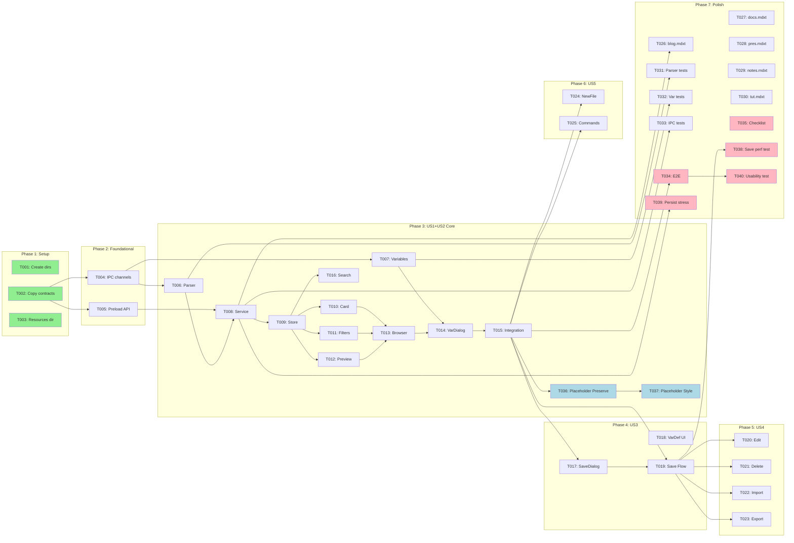

# Tasks: Template Library

**Feature**: Template Library (see [plan.md](./plan.md) for summary)
**Generated**: 2026-01-17
**Orchestration**: enabled

## Prerequisites

| Document | Status | Purpose |
|----------|--------|---------|
| plan.md | ✅ Present | Tech stack, structure, dependencies |
| spec.md | ✅ Present | User stories with priorities |
| data-model.md | ✅ Present | Entity definitions |
| contracts/ | ✅ Present | IPC endpoint specifications |
| research.md | ✅ Present | Technical decisions |
| quickstart.md | ✅ Present | Implementation patterns |

---

## Execution Constraints

```yaml
# Claude Code MAXIMUM POWER Config (Jan 2026 - Claude Max 20x)
# ⚡ SINGLE SESSION FULL THROTTLE - Token cost is not a concern ⚡

model: opus-4.5                    # Most capable model
max_parallel_subagents: 10         # Hard cap enforced by Claude Code
queue_overflow: true               # Tasks beyond 10 auto-queue, refill on complete

# Async/Background Agents (v2.0.60+)
async_background:
  enabled: true
  hotkey: Ctrl+B
  wake_on_complete: true
  background_research: true

# Timeouts (generous for Opus deep reasoning)
default_task_timeout: 10m
gate_timeout: 2m
subagent_timeout: 15m

# Fault Tolerance
circuit_breaker:
  max_failures_per_batch: 5
  action: pause_and_report
retry_policy:
  max_attempts: 3
  backoff: exponential

# Subagent Dispatch Strategy
subagent_dispatch:
  strategy: greedy_queue
  refill_on_complete: true
  context_per_agent: 200k
  extended_thinking: true
  ultrathink: complex

# Batch Optimization
batch_strategy:
  prefer_wider_batches: true
  merge_small_batches: true
  max_batch_size: 10
```

---

## Quick Start

### Sequential Execution (Simple)

Execute tasks in order: T001 → T002 → T003 → ...

- Run gate validation after each phase completes
- Safe, predictable, no coordination needed

### Parallel Execution (Recommended) ⚡

1. **Greedy dispatch**: Spawn subagents for ALL tasks in current batch simultaneously
2. **Stream completions**: Process results as each subagent finishes
3. **Gate on batch complete**: Only run validation after ALL batch tasks finish
4. **Cascade immediately**: Start next batch's tasks the instant gate passes

---

## Implementation Patterns

All Phase 3+ implementation tasks reference `quickstart.md` patterns. Key patterns:

| Pattern | Usage | Reference |
|---------|-------|-----------|
| **gray-matter parsing** | Template frontmatter extraction | `quickstart.md#template-parsing` |
| **Zustand + Immer store** | State management with immutable updates | `quickstart.md#store-pattern` |
| **IPC handler** | Main process request handling with zod validation | `quickstart.md#ipc-pattern` |
| **React component** | Functional component with TypeScript props | `quickstart.md#component-pattern` |

Individual tasks specify WHAT to implement; patterns specify HOW.

---

## Gate Validation Strategy

Gates use three validation types:

| Type | Command | Purpose |
|------|---------|---------|
| **File Existence** | `test -f path` or `test -d path` | Verify artifacts created |
| **Type Check** | `npx tsc --noEmit file.ts` | Verify TypeScript compiles |
| **Runtime Test** | `npx vitest run tests/...` | Verify behavior correct |

**Gate Failure Protocol**:
1. Read error output completely
2. Check On-Fail guidance for common causes
3. Fix issue in failing task
4. Re-run gate only (not entire batch)

---

## Phase 1: Setup

**Purpose**: Project structure and contract installation
**Estimated Duration**: 5-10 minutes
**Max Parallelism**: 3 subagents

### Batch 1.1: Project Scaffolding (parallel) ⚡

- [x] T001 [P:1.1] Create template browser component directory at `src/renderer/components/template-browser/`
- [x] T002 [P:1.1] Copy contract schemas from `.specify/specs/016-template-library/contracts/template-schemas.ts` to `src/shared/contracts/template-schemas.ts`
- [x] T003 [P:1.1] Create built-in templates directory at `resources/templates/`

#### Gate 1.1: Setup Validation

```bash
test -d src/renderer/components/template-browser && \
test -f src/shared/contracts/template-schemas.ts && \
test -d resources/templates
```

**On-Fail**: Verify plan.md project structure; check directory permissions

---

## Phase 2: Foundational

**Purpose**: IPC infrastructure and preload bindings that ALL features depend on
**Estimated Duration**: 10-15 minutes
**Max Parallelism**: 2 subagents

⚠️ **BLOCKING**: No user story work can begin until this phase completes

### Batch 2.1: IPC Infrastructure (parallel) ⚡

<!-- Context: plan.md#shared, contracts/template-schemas.ts -->
- [ ] T004 [P:2.1] Add TEMPLATE_IPC_CHANNEL and TEMPLATE_CREATE_CHANNEL exports to `src/shared/ipc-channels.ts`
- [ ] T005 [P:2.1] Expose template API bindings in `src/preload/index.ts`: `list()`, `get(id)`, `save(template)`, `delete(id)`, `import(path)`, `export(id, path)`, `validate(content)`, `createFromTemplate(id, variables)` — all with zod-validated IPC

#### Gate 2.1: IPC Validation

```bash
npx tsc --noEmit src/shared/ipc-channels.ts src/preload/index.ts 2>&1 | head -20
```

**On-Fail**: Check contracts/template-schemas.ts imports; verify IPC channel naming convention

**✓ Checkpoint**: Foundation ready — user story implementation can begin

---

## Phase 3: User Story 1+2 Core — Template Browser Infrastructure (Priority: P1) 🎯 MVP

**Goal**: Core infrastructure shared by US1 (Create from Template) and US2 (Browse/Filter)
**Independent Test**: Template list loads and displays in browser modal
**Estimated Duration**: 30-40 minutes
**Max Parallelism**: 4 subagents

### Batch 3.1: Library Code (parallel) ⚡

<!-- Context: plan.md#lib, research.md#template-parsing, data-model.md -->
- [ ] T006 [P:3.1] [US1] Implement template parser with gray-matter in `src/renderer/lib/template-parser.ts` per quickstart.md pattern
- [ ] T007 [P:3.1] [US1] Implement variable extraction and substitution in `src/renderer/lib/template-variables.ts` per quickstart.md pattern

#### Gate 3.1: Library Validation

```bash
npx tsc --noEmit src/renderer/lib/template-parser.ts src/renderer/lib/template-variables.ts 2>&1 | head -20
```

**On-Fail**: Check gray-matter import; verify zod schema imports from contracts

### Batch 3.2: Service Layer (parallel) ⚡

<!-- Context: plan.md#services, contracts/template-schemas.ts, research.md#storage -->
- [ ] T008 [P:3.2] [US1] Implement template-service.ts in `src/main/services/template-service.ts` with IPC handlers for list, get, save, delete, import, export, validate
- [ ] T009 [P:3.2] [US2] Implement template-store.ts in `src/renderer/stores/template-store.ts` with Zustand + Immer per quickstart.md pattern

#### Gate 3.2: Service Validation

```bash
npx tsc --noEmit src/main/services/template-service.ts src/renderer/stores/template-store.ts 2>&1 | head -20 && \
grep -q "safeParse" src/main/services/template-service.ts && echo "zod validation present"
```

**On-Fail**: Verify IPC channel registration in main process; check Zustand store pattern; ensure all IPC handlers use `schema.safeParse()` per Article III.3

### Batch 3.3: UI Components — Cards and Filters (parallel) ⚡

<!-- Context: plan.md#components, data-model.md#TemplateMetadata -->
- [ ] T010 [P:3.3] [US2] Implement TemplateCard.tsx in `src/renderer/components/template-browser/TemplateCard.tsx` displaying name, description, category badge, built-in indicator
- [ ] T011 [P:3.3] [US2] Implement TemplateFilters.tsx in `src/renderer/components/template-browser/TemplateFilters.tsx` with search input, category dropdown, clear button

#### Gate 3.3: Card and Filter Validation

```bash
npx tsc --noEmit src/renderer/components/template-browser/TemplateCard.tsx src/renderer/components/template-browser/TemplateFilters.tsx 2>&1 | head -20
```

**On-Fail**: Check React component structure; verify props match TemplateMetadata type

### Batch 3.4: UI Components — Preview and Browser (parallel) ⚡

<!-- Context: plan.md#components, Spec 003 preview integration -->
- [ ] T012 [P:3.4] [US1] Implement TemplatePreview.tsx in `src/renderer/components/template-browser/TemplatePreview.tsx` reusing Spec 003 preview infrastructure
- [ ] T013 [P:3.4] [US1] Implement TemplateBrowser.tsx in `src/renderer/components/template-browser/TemplateBrowser.tsx` with modal, split pane, keyboard navigation (FR-019)

#### Gate 3.4: Browser Validation

```bash
npx tsc --noEmit src/renderer/components/template-browser/TemplatePreview.tsx src/renderer/components/template-browser/TemplateBrowser.tsx 2>&1 | head -20
```

**On-Fail**: Verify Spec 003 preview component exists; check modal dialog patterns

### Batch 3.5: Variable Dialog

<!-- Context: plan.md#components, data-model.md#TemplateVariable -->
- [ ] T014 [P:3.5] [US1] Implement VariableDialog.tsx in `src/renderer/components/template-browser/VariableDialog.tsx` with form inputs for each variable, validation, defaults (FR-024, FR-026)

#### Gate 3.5: Variable Dialog Validation

```bash
npx tsc --noEmit src/renderer/components/template-browser/VariableDialog.tsx 2>&1 | head -20
```

**On-Fail**: Check form component imports; verify TemplateVariable type usage

### Batch 3.6: US1+US2 Integration

- [ ] T015 [US1] Wire up template browser in application shell, connect store to components, handle template selection and document creation flow

**T015 Acceptance Criteria** (per spec.md US1):
- Template browser modal opens from menu/command palette
- Template selection triggers live preview in right pane
- "Create" button creates new document with template content
- Dynamic variables prompt VariableDialog before creation
- New document opens in editor with substituted content
- [ ] T016 [US2] Implement Fuse.js search integration in template store for fuzzy matching (SC-004: < 200ms); include "no results" help message per US2-4
- [ ] T036 [US1] Implement static placeholder marker preservation in document creation flow — detect `[TODO: ...]` patterns and preserve in created document (FR-020, FR-027)
- [ ] T037 [US1] Add visual styling for static placeholder markers in editor — apply `.mdx-placeholder` CSS class with `border: 1px dashed #888`, `background: rgba(255,193,7,0.1)` (FR-025, FR-028)

#### Gate 3.6: Integration Validation

```bash
npx tsc --noEmit src/renderer/components/template-browser/*.tsx src/renderer/stores/template-store.ts 2>&1 | head -20
```

**On-Fail**: Check component imports; verify store actions are called correctly

**✓ Checkpoint**: User Story 1+2 complete — users can browse, filter, preview, and create documents from templates

---

## Phase 4: User Story 3 — Create Custom Template (Priority: P2)

**Goal**: Allow users to save open documents as reusable templates
**Independent Test**: Save current document as template, verify it appears in library
**Estimated Duration**: 20-25 minutes
**Max Parallelism**: 2 subagents

### Batch 4.1: Save Template Dialog (parallel) ⚡

<!-- Context: plan.md#components, data-model.md#Template, FR-009, FR-010 -->
- [ ] T017 [P:4.1] [US3] Implement SaveTemplateDialog.tsx in `src/renderer/components/template-browser/SaveTemplateDialog.tsx` with name, description, category, tags form
- [ ] T018 [P:4.1] [US3] Add variable definition UI to SaveTemplateDialog for declaring template variables

#### Gate 4.1: Save Dialog Validation

```bash
npx tsc --noEmit src/renderer/components/template-browser/SaveTemplateDialog.tsx 2>&1 | head -20
```

**On-Fail**: Check form validation; verify TemplateSaveRequest schema usage

### Batch 4.2: Save Template Integration

<!-- Context: contracts/template-schemas.ts#TemplateSaveRequest -->
- [ ] T019 [US3] Wire SaveTemplateDialog to template service, handle duplicate name detection (FR-010), validate MDX before save (FR-015)

#### Gate 4.2: Save Integration Validation

```bash
npx tsc --noEmit src/renderer/components/template-browser/SaveTemplateDialog.tsx src/main/services/template-service.ts 2>&1 | head -20
```

**On-Fail**: Verify save IPC handler; check MDX validation integration

**✓ Checkpoint**: User Story 3 complete — users can save documents as custom templates

---

## Phase 5: User Story 4 — Manage Custom Templates (Priority: P2)

**Goal**: Enable editing and deletion of custom templates
**Independent Test**: Edit template metadata, delete template, verify changes persist
**Estimated Duration**: 15-20 minutes
**Max Parallelism**: 2 subagents

### Batch 5.1: Template Management (parallel) ⚡

<!-- Context: FR-012, FR-013, FR-014 -->
- [ ] T020 [P:5.1] [US4] Add edit template metadata functionality to TemplateBrowser.tsx with inline or modal editing
- [ ] T021 [P:5.1] [US4] Add delete template functionality with confirmation dialog, prevent deletion of built-in templates (FR-014)

#### Gate 5.1: Management Validation

```bash
npx tsc --noEmit src/renderer/components/template-browser/TemplateBrowser.tsx 2>&1 | head -20
```

**On-Fail**: Check edit/delete actions; verify built-in template protection

### Batch 5.2: Import/Export (parallel) ⚡

<!-- Context: FR-021, FR-022, FR-023, research.md#file-format -->
- [ ] T022 [P:5.2] [US4] Implement template import flow with file picker, parse .mdxt, handle duplicates
- [ ] T023 [P:5.2] [US4] Implement template export flow with save dialog, write .mdxt to chosen path

#### Gate 5.2: Import/Export Validation

```bash
npx tsc --noEmit src/main/services/template-service.ts 2>&1 | head -20
```

**On-Fail**: Check file dialog integration; verify .mdxt parsing

**✓ Checkpoint**: User Story 4 complete — users can manage their custom template collection

---

## Phase 6: User Story 5 — New File Integration (Priority: P3)

**Goal**: Integrate template selection into new file workflow
**Independent Test**: Trigger New File, select "From Template", verify template browser opens
**Estimated Duration**: 15-20 minutes
**Max Parallelism**: 2 subagents

### Batch 6.1: Integration Points (parallel) ⚡

<!-- Context: FR-016, Spec 005 command palette -->
- [ ] T024 [P:6.1] [US5] Add "From Template" option to new file dialog/flow, hook into existing file creation
- [ ] T025 [P:6.1] [US5] Register template commands in command palette: "Template: Browse Templates", "Template: Save as Template", "Template: Import Template"

#### Gate 6.1: Integration Validation

```bash
npx tsc --noEmit 2>&1 | head -30
```

**On-Fail**: Check command palette registration; verify new file dialog integration

**✓ Checkpoint**: User Story 5 complete — templates integrated into standard workflows

---

## Phase 7: Built-in Templates & Polish

**Purpose**: Create bundled templates and finalize quality
**Estimated Duration**: 25-30 minutes
**Max Parallelism**: 5 subagents

### Batch 7.1: Built-in Templates (parallel) ⚡

<!-- Context: SC-006: 5 common document types -->
- [ ] T026 [P:7.1] Create blog-post.mdxt in `resources/templates/blog-post.mdxt` with title, author, date variables
- [ ] T027 [P:7.1] Create documentation.mdxt in `resources/templates/documentation.mdxt` with title, description variables
- [ ] T028 [P:7.1] Create presentation.mdxt in `resources/templates/presentation.mdxt` with title, subtitle variables
- [ ] T029 [P:7.1] Create meeting-notes.mdxt in `resources/templates/meeting-notes.mdxt` with date, attendees variables
- [ ] T030 [P:7.1] Create tutorial.mdxt in `resources/templates/tutorial.mdxt` with title, topic variables

#### Gate 7.1: Template Validation

```bash
test -f resources/templates/blog-post.mdxt && \
test -f resources/templates/documentation.mdxt && \
test -f resources/templates/presentation.mdxt && \
test -f resources/templates/meeting-notes.mdxt && \
test -f resources/templates/tutorial.mdxt && \
echo "All 5 built-in templates created" && \
for f in resources/templates/*.mdxt; do \
  grep -q "^name:" "$f" && grep -q "^description:" "$f" && \
  grep -q "^category:" "$f" && grep -q "^tags:" "$f" || \
  (echo "FAIL: $f missing required frontmatter" && exit 1); \
done && echo "FR compliance verified: all templates have name, description, category, tags"
```

**On-Fail**: Check .mdxt file format; verify YAML frontmatter includes all required fields per FR-018 through FR-024

### Batch 7.2: Tests (parallel) ⚡

- [ ] T031 [P:7.2] Create unit tests for template-parser.ts in `tests/unit/template-parser.test.ts`
- [ ] T032 [P:7.2] Create unit tests for template-variables.ts in `tests/unit/template-variables.test.ts`
- [ ] T033 [P:7.2] Create integration tests for template IPC in `tests/integration/template-ipc.test.ts`
- [ ] T038 [P:7.2] Create performance test for custom template save operation — validate < 2s completion including MDX validation (SC-005)
- [ ] T039 [P:7.2] Create integration test for custom template persistence across 100 simulated app restart cycles (SC-008)

#### Gate 7.2: Test Validation

```bash
npx vitest run tests/unit/template-parser.test.ts tests/unit/template-variables.test.ts --passWithNoTests 2>&1 | tail -10
```

**On-Fail**: Check test imports; verify vitest configuration

### Batch 7.3: E2E and Polish

- [ ] T034 Create E2E tests for template browser in `tests/e2e/template-browser.spec.ts` covering quickstart.md test scenarios
- [ ] T035 Run quickstart.md validation checklist: keyboard navigation (SC-007), search performance < 200ms (SC-004), preview rendering < 1s (SC-002), template browsing < 30s to first document (SC-001)
- [ ] T040 Conduct usability testing session with 5+ users — measure first-attempt success rate for template document creation, validate >= 90% (SC-003)

#### Gate 7.3: Final Validation

```bash
npx tsc --noEmit && echo "Type check passed"
```

**On-Fail**: Review type errors; check all imports resolve

---

## Dependency Graph



---

## Parallel Execution Summary

| Phase | Name | Batches | Tasks | Max Parallel | Critical Path | Independent |
|-------|------|---------|-------|--------------|---------------|-------------|
| 1 | Setup | 1 | 3 | 3 | T001 | No |
| 2 | Foundational | 1 | 2 | 2 | T004 → T005 | No |
| 3 | US1+US2 Core | 6 | 13 | 4 | T006 → T008 → T009 → T013 → T014 → T015 → T036 | No |
| 4 | US3 | 2 | 3 | 2 | T017 → T019 | **Yes** |
| 5 | US4 | 2 | 4 | 2 | T020 → T022 | **Yes** |
| 6 | US5 | 1 | 2 | 2 | T024 | **Yes** |
| 7 | Polish | 3 | 13 | 5 | T026 → T034 → T040 | No |
| **Total** | | **16** | **40** | **10 (hard cap)** | **Critical: 9 tasks** | |

### Parallelism Metrics

| Metric | Value | Notes |
|--------|-------|-------|
| **Total Tasks** | 40 | Sum of all tasks (T001-T040) |
| **Critical Path Length** | 9 | T002 → T004 → T006 → T008 → T009 → T013 → T014 → T015 → T036 |
| **Parallelism Factor** | 4.4x | 40 tasks / 9 critical |
| **Max Concurrent Subagents** | 10 | Hard cap per Claude session |
| **Queue Overflow** | Unlimited | Tasks >10 auto-queue, greedy refill |
| **Theoretical Speedup** | 4.4x | With unlimited parallelism |
| **Practical Speedup** | 3.8x | With 10 slots + greedy refill |

### Parallel Execution Windows

```
Time →
├─ Setup (3 tasks, 1 batch) ─────────────────────┤
├─ Foundational (2 tasks, 1 batch) ──────────────┤
├─ US1+US2 Core (11 tasks, 6 batches) ───────────┤  ← Sequential, shared deps
├─ [US3 + US4 + US5 can interleave] ─────────────┤  ← Independent after US1+US2
├─ Polish (10 tasks, 3 batches) ─────────────────┤
```

---

## Dependencies

### Phase Dependencies

```
Phase 1 (Setup)
    ↓
Phase 2 (Foundational) ← BLOCKS ALL USER STORIES
    ↓
Phase 3 (US1+US2 Core) ← Shared infrastructure for MVP
    ↓
┌───────────────┬───────────────┬───────────────┐
↓               ↓               ↓
Phase 4 (US3)   Phase 5 (US4)   Phase 6 (US5)   ← Can run in parallel
└───────────────┴───────────────┴───────────────┘
                        ↓
                Phase 7 (Polish)
```

### User Story Independence

| Story | Can Start After | Dependencies on Other Stories |
|-------|-----------------|------------------------------|
| US1+US2 | Phase 2 complete | None (core MVP) |
| US3 | Phase 3 complete | Depends on US1+US2 template browser |
| US4 | Phase 3 complete | Depends on US1+US2 template browser |
| US5 | Phase 3 complete | Depends on US1+US2 template browser |

### Critical Path Analysis

```
T002 → T004 → T006 → T008 → T009 → T013 → T014 → T015 → T036
  ↑      ↑      ↑      ↑      ↑      ↑       ↑      ↑      ↑
Setup  Found. Parser Service Store  Browser VarDlg Integ Placeholder
```

**Bottleneck**: Phase 3 (US1+US2 Core) — 6 sequential batches with dependencies

---

## Recovery Playbook

### Partial Batch Failure

**Symptoms**: Some tasks in batch succeed, others fail

**Recovery**:
1. Check gate output for specific failures
2. Fix failing task(s) individually
3. Re-run only failed tasks, not entire batch
4. Re-run gate validation

### Gate Validation Failure

**Symptoms**: All tasks complete but gate fails

**Recovery**:
1. Read gate error output carefully
2. Common causes:
   - Import errors → missing dependency or typo
   - Type errors → run `npx tsc --noEmit` on specific file
   - Missing file → task didn't create expected output
3. Fix identified issue
4. Re-run gate only

### TypeScript Errors

**Common fixes**:
- `Cannot find module` → Check import path, verify contracts copied
- `Property does not exist` → Verify field names match data-model.md
- `Type X is not assignable` → Check zod schema usage

---

## Notes

- **[P:X.Y]** = Batch identifier; same ID means parallel-safe
- **Gates** = Validation checkpoints; don't skip them
- **Checkpoints** = Safe stopping points; story is complete and testable
- Commit after each gate passes
- US3, US4, US5 can run in parallel after Phase 3 completes
- Built-in templates (Phase 7.1) can start as soon as template service is ready
