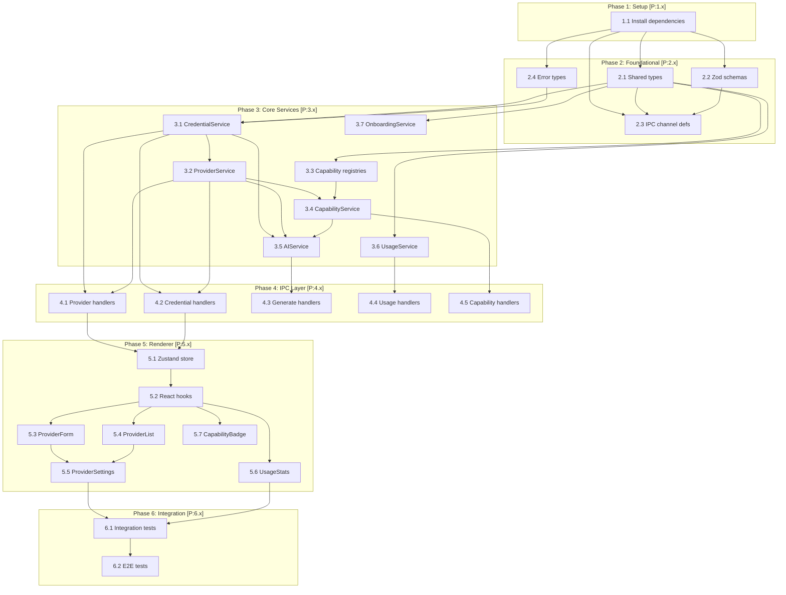

# Implementation Tasks: AI Provider Abstraction Layer

**Feature Branch**: `028-ai-provider-abstraction`
**Generated**: 2026-01-17
**Source**: [plan.md](./plan.md) | [spec.md](./spec.md)

---

## Task Dependency Overview



---

## Parallelism Metrics

| Metric | Value |
|--------|-------|
| Total Tasks | 30 |
| Parallel Batches | 12 |
| Max Parallelism | 4 (Phase 2, Phase 3 services) |
| Critical Path Length | 12 tasks |
| Estimated Parallelism Efficiency | 50% |

---

## Phase 1: Setup [P:1.x]

### [P:1.1] Install AI SDK dependencies

**Description**: Install Vercel AI SDK and provider packages.

**Files**:
- `package.json`

**Commands**:
```bash
pnpm add ai @ai-sdk/openai @ai-sdk/anthropic @ai-sdk/openai-compatible
pnpm add -D ollama-ai-provider
```

**Acceptance Criteria**:
- [x] AI SDK packages installed
- [x] `pnpm build` succeeds

**Dependencies**: None

**FR Coverage**: FR-001, FR-014

---

## Phase 2: Foundational [P:2.x]

### GATE: Phase 1 Complete
- [x] All Phase 1 tasks completed
- [x] Build passes

---

### [P:2.1] Create shared type definitions

**Description**: Define TypeScript types for entities from data-model.md.

**Files**:
- `src/shared/ai/types.ts`

**Entities**:
- `ProviderType`
- `ConnectionStatus`
- `OperationType`
- `ProviderCapability` (use `z.infer<typeof ProviderCapabilitySchema>` for runtime; TypeScript enum for IDE support only)
- `ProviderConfig`
- `CredentialMetadata`
- `UsageRecord`
- `ModelCapabilities`
- `CapabilityConstraints`
- `OnboardingMetrics`
- `OnboardingAttempt`

**Acceptance Criteria**:
- [x] All types from data-model.md defined
- [x] Types use `readonly` for immutable fields
- [x] No `any` types (Constitution VI.1)
- [x] TypeScript compiles with strict: true

**Dependencies**: [P:1.1]

**FR Coverage**: FR-001

---

### [P:2.2] Create Zod validation schemas

**Description**: Define Zod schemas for IPC validation from ipc-channels.md.

**Files**:
- `src/shared/ai/schemas.ts`

**Schemas**:
- `ProviderTypeSchema`
- `ConnectionStatusSchema`
- `OperationTypeSchema`
- `ProviderCapabilitySchema`
- `ProviderConfigSchema`
- All request/response schemas from ipc-channels.md

**Acceptance Criteria**:
- [x] All schemas from ipc-channels.md defined
- [x] Schemas match types from types.ts
- [x] Schema inference types exported

**Dependencies**: [P:2.1]

**FR Coverage**: FR-001

---

### [P:2.3] Create IPC channel definitions

**Description**: Define IPC channel constants and type-safe helpers.

**Files**:
- `src/shared/ai/ipc-channels.ts`

**Channels**:
- `mdxpad:ai:provider:*` (list, add, update, remove, set-active, validate)
- `mdxpad:ai:credential:*` (set, has, clear)
- `mdxpad:ai:generate:*` (text, stream, embed, image)
- `mdxpad:ai:usage:*` (query, export, clear)
- `mdxpad:ai:capability:*` (get, list-models, refresh)
- `mdxpad:ai:stream:*` (chunk, complete, error) - renderer receive-only via webContents.send

**Acceptance Criteria**:
- [x] All channels from ipc-channels.md defined
- [x] Channel constants use `mdxpad:ai:<domain>:<action>` format
- [x] Follows Constitution III.3 naming convention

**Dependencies**: [P:2.1], [P:2.2]

**FR Coverage**: FR-001

---

### [P:2.4] Create error types

**Description**: Define typed error classes from service-interfaces.md.

**Files**:
- `src/shared/ai/errors.ts`

**Error Types**:
- `AIProviderError` (base)
- `NoActiveProviderError`
- `ProviderNotFoundError`
- `ProviderDisconnectedError`
- `CapabilityNotSupportedError`
- `RateLimitError`
- `CredentialStorageError`
- `InvalidApiKeyError`

**Acceptance Criteria**:
- [x] All errors from service-interfaces.md defined
- [x] Errors extend base `AIProviderError`
- [x] Each error has unique `code` property

**Dependencies**: [P:1.1]

**FR Coverage**: FR-012, FR-015

---

## Phase 3: Core Services [P:3.x]

### GATE: Phase 2 Complete
- [x] All Phase 2 tasks completed
- [x] `pnpm typecheck` passes (skipLibCheck)
- [x] Shared types importable from main process

---

### [P:3.1] Implement CredentialService

**Description**: Implement secure credential storage using Electron safeStorage.

**Files**:
- `src/main/services/ai/credential-service.ts`
- `tests/unit/services/ai/credential-service.test.ts`

**Interface**: `ICredentialService` from service-interfaces.md

**Methods**:
- `isAvailable(): boolean`
- `setCredential(providerId, apiKey): Promise<CredentialSetResult>`
- `getCredential(providerId): Promise<string | null>`
- `hasCredential(providerId): Promise<CredentialMetadata | null>`
- `clearCredential(providerId): Promise<boolean>`
- `getStorageType(): 'persistent' | 'session'`

**Key Implementation**:
- Use `safeStorage.encryptString()` / `decryptString()`
- Store encrypted bytes in electron-store
- Session-only fallback via in-memory Map (FR-013)

**Acceptance Criteria**:
- [ ] All interface methods implemented
- [ ] Unit tests with >80% coverage
- [ ] safeStorage mocked in tests
- [ ] Session fallback tested

**Dependencies**: [P:2.1], [P:2.4]

**FR Coverage**: FR-002, FR-011, FR-013

---

### [P:3.2] Implement ProviderService

**Description**: Implement provider configuration CRUD and lifecycle management.

**Files**:
- `src/main/services/ai/provider-service.ts`
- `tests/unit/services/ai/provider-service.test.ts`

**Interface**: `IProviderService` from service-interfaces.md

**Methods**:
- `getProviders(): Promise<ProviderConfig[]>`
- `getProvider(id): Promise<ProviderConfig | null>`
- `getActiveProvider(): Promise<ProviderConfig | null>`
- `addProvider(config, apiKey?): Promise<ProviderConfig>`
- `updateProvider(id, updates): Promise<ProviderConfig>`
- `removeProvider(id): Promise<void>`
- `setActiveProvider(id): Promise<void>`
- `validateProvider(id): Promise<ProviderValidationResult>`
- `getProviderCount(): Promise<number>`

**Key Implementation**:
- Store configs in electron-store (`mdxpad-providers.json`)
- Enforce single active provider constraint
- Max 10 providers (SC-005)
- Coordinate with CredentialService for credential storage
- validateProvider: 10-second timeout with AbortController; network errors return `{ valid: false, error: 'network_error', message: 'Unable to reach provider' }`

**Acceptance Criteria**:
- [ ] All interface methods implemented
- [ ] Unit tests with >80% coverage
- [ ] Enforces max 10 providers
- [ ] Enforces single active provider
- [ ] Network timeout handling tested

**Dependencies**: [P:2.1], [P:2.4], [P:3.1]

**FR Coverage**: FR-001, FR-003, FR-004, FR-005, FR-010

---

### [P:3.3] Create capability registries

**Description**: Create static capability registries for cloud providers.

**Files**:
- `src/main/services/ai/registries/openai-registry.ts`
- `src/main/services/ai/registries/anthropic-registry.ts`

**Models to Include**:

OpenAI:
- gpt-4o, gpt-4o-mini, gpt-4-turbo, gpt-4
- o1, o1-mini, o1-pro
- text-embedding-3-small, text-embedding-3-large
- dall-e-3

Anthropic:
- claude-opus-4-5-20251101, claude-sonnet-4-5-20251101
- claude-3-5-sonnet-20241022, claude-3-5-haiku-20241022
- claude-3-opus-20240229

**Acceptance Criteria**:
- [ ] All current models registered
- [ ] Capabilities accurate per provider docs
- [ ] Context windows and constraints defined

**Dependencies**: [P:2.1]

**FR Coverage**: FR-016

---

### [P:3.4] Implement CapabilityService

**Description**: Implement capability detection with static + dynamic hybrid.

**Files**:
- `src/main/services/ai/capability-service.ts`
- `tests/unit/services/ai/capability-service.test.ts`

**Interface**: `ICapabilityService` from service-interfaces.md

**Methods**:
- `getCapabilities(providerId, modelId): Promise<ModelCapabilities>`
- `listModels(providerId): Promise<ModelInfo[]>`
- `hasCapability(providerId, modelId, capability): Promise<boolean>`
- `refreshCapabilities(providerId): Promise<void>`
- `getProvidersWithCapability(capability): Promise<string[]>`

**Key Implementation** (per plan.md Key Technical Decisions §3):
- Static registry lookup for OpenAI/Anthropic
- Dynamic probe for Ollama (`/api/show` endpoint)
- 5-minute TTL cache for dynamic capabilities

**Acceptance Criteria**:
- [ ] All interface methods implemented
- [ ] Unit tests with >80% coverage
- [ ] Static registry used for cloud providers
- [ ] Dynamic detection for Ollama tested

**Dependencies**: [P:3.2], [P:3.3]

**FR Coverage**: FR-016

---

### [P:3.5] Implement AIService

**Description**: Implement AI operations using Vercel AI SDK.

**Files**:
- `src/main/services/ai/ai-service.ts`
- `tests/unit/services/ai/ai-service.test.ts`

**Interface**: `IAIService` from service-interfaces.md

**Methods**:
- `generateText(request): Promise<TextGenerationResponse>`
- `streamText(request, onChunk): Promise<StreamController>`
- `generateEmbedding(request): Promise<EmbeddingResponse>`
- `generateImage(request): Promise<ImageGenerationResponse>`
- `getActiveModel(): LanguageModel | null`
- `isReady(): boolean`

**Key Implementation**:
- Use AI SDK's `generateText()`, `streamText()`, `embed()`
- Route through active provider from ProviderService
- Load credentials from CredentialService
- Check capabilities before operations

**Acceptance Criteria**:
- [ ] All interface methods implemented
- [ ] Unit tests with >80% coverage
- [ ] Streaming with abort controller
- [ ] Capability check before operations

**Dependencies**: [P:3.1], [P:3.2], [P:3.4]

**FR Coverage**: FR-014, FR-017

---

### [P:3.6] Implement UsageService

**Description**: Implement usage tracking and statistics.

**Files**:
- `src/main/services/ai/usage-service.ts`
- `tests/unit/services/ai/usage-service.test.ts`

**Interface**: `IUsageService` from service-interfaces.md

**Methods**:
- `recordUsage(record: Omit<UsageRecord, 'id' | 'timestamp'>): Promise<void>` - timestamp set by service
- `queryStats(query): Promise<UsageStats>`
- `exportData(timeRange, format): Promise<string>`
- `clearHistory(beforeDate?): Promise<void>`
- `getEstimatedCost(providerId, timeRange): Promise<number>`

**Key Implementation**:
- Store in electron-store (`mdxpad-usage.json`)
- 90-day retention, max 100K records
- FIFO pruning when limits exceeded (oldest records removed first)
- Cost estimation using hardcoded provider pricing tables

**Acceptance Criteria**:
- [ ] All interface methods implemented
- [ ] Unit tests with >80% coverage
- [ ] Record pruning tested
- [ ] Cost calculation accurate within 1% (SC-004)

**Dependencies**: [P:2.1]

**FR Coverage**: FR-006, FR-007, FR-008

---

### [P:3.7] Implement OnboardingService

**Description**: Implement onboarding analytics for SC-006 measurement.

**Files**:
- `src/main/services/ai/onboarding-service.ts`
- `tests/unit/services/ai/onboarding-service.test.ts`

**Interface**: `IOnboardingService` from service-interfaces.md

**Methods**:
- `startAttempt(providerType): string`
- `recordOutcome(attemptId, outcome, details?): Promise<void>`
- `getMetrics(): Promise<OnboardingMetrics>`
- `resetMetrics(): Promise<void>`

**Key Implementation**:
- Store in electron-store (`mdxpad-onboarding.json`)
- 30-day record retention
- Calculate success rate for SC-006

**Acceptance Criteria**:
- [ ] All interface methods implemented
- [ ] Unit tests with >80% coverage
- [ ] Success rate calculation tested

**Dependencies**: [P:2.1]

**FR Coverage**: FR-018

---

### [P:3.8] Create service index and exports (main process)

**Description**: Create index file exporting all services.

**Files**:
- `src/main/services/ai/index.ts`

**Exports**:
- All service classes
- Singleton instances

**Acceptance Criteria**:
- [ ] All services exported
- [ ] Singleton pattern implemented

**Dependencies**: [P:3.1], [P:3.2], [P:3.4], [P:3.5], [P:3.6], [P:3.7]

**FR Coverage**: FR-001

---

## Phase 4: IPC Layer [P:4.x]

### GATE: Phase 3 Complete
- [ ] All Phase 3 tasks completed
- [ ] All service unit tests pass with >80% coverage
- [ ] `pnpm test` passes

---

### [P:4.1] Implement provider IPC handlers

**Description**: Implement IPC handlers for provider management channels.

**Files**:
- `src/main/ipc/ai-handlers.ts` (provider section)

**Channels**:
- `mdxpad:ai:provider:list`
- `mdxpad:ai:provider:add`
- `mdxpad:ai:provider:update`
- `mdxpad:ai:provider:remove`
- `mdxpad:ai:provider:set-active`
- `mdxpad:ai:provider:validate`

**Acceptance Criteria**:
- [ ] All provider channels implemented
- [ ] Zod validation on all requests
- [ ] Error codes match ipc-channels.md
- [ ] Handlers delegate to ProviderService

**Dependencies**: [P:3.1], [P:3.2]

**FR Coverage**: FR-001, FR-003, FR-004, FR-005

---

### [P:4.2] Implement credential IPC handlers

**Description**: Implement IPC handlers for credential management channels.

**Files**:
- `src/main/ipc/ai-handlers.ts` (credential section)

**Channels**:
- `mdxpad:ai:credential:set`
- `mdxpad:ai:credential:has`
- `mdxpad:ai:credential:clear`

**Acceptance Criteria**:
- [ ] All credential channels implemented
- [ ] Zod validation on all requests
- [ ] Returns storageType and keyPreview
- [ ] Handlers delegate to CredentialService

**Dependencies**: [P:3.1]

**FR Coverage**: FR-002, FR-011, FR-013

---

### [P:4.3] Implement generate IPC handlers

**Description**: Implement IPC handlers for AI generation channels.

**Files**:
- `src/main/ipc/ai-handlers.ts` (generate section)

**Channels**:
- `mdxpad:ai:generate:text`
- `mdxpad:ai:generate:stream`
- `mdxpad:ai:generate:embed`
- `mdxpad:ai:generate:image`

**Streaming Implementation**:
- Return `streamId` from `generate:stream`
- Send chunks via `webContents.send('mdxpad:ai:stream:chunk', ...)`
- Send completion via `webContents.send('mdxpad:ai:stream:complete', ...)`

**Acceptance Criteria**:
- [ ] All generate channels implemented
- [ ] Streaming uses webContents.send pattern
- [ ] Usage recorded after each request
- [ ] Rate limit errors include alternateProviders

**Dependencies**: [P:3.5], [P:3.6]

**FR Coverage**: FR-014, FR-015, FR-017

---

### [P:4.4] Implement usage IPC handlers

**Description**: Implement IPC handlers for usage statistics channels.

**Files**:
- `src/main/ipc/ai-handlers.ts` (usage section)

**Channels**:
- `mdxpad:ai:usage:query`
- `mdxpad:ai:usage:export`
- `mdxpad:ai:usage:clear`

**Acceptance Criteria**:
- [ ] All usage channels implemented
- [ ] Time range filtering works correctly
- [ ] Export supports JSON and CSV formats

**Dependencies**: [P:3.6]

**FR Coverage**: FR-006, FR-007, FR-008

---

### [P:4.5] Implement capability IPC handlers

**Description**: Implement IPC handlers for capability detection channels.

**Files**:
- `src/main/ipc/ai-handlers.ts` (capability section)

**Channels**:
- `mdxpad:ai:capability:get`
- `mdxpad:ai:capability:list-models`
- `mdxpad:ai:capability:refresh`

**Acceptance Criteria**:
- [ ] All capability channels implemented
- [ ] Returns capabilities as array
- [ ] Refresh clears cache for provider

**Dependencies**: [P:3.4]

**FR Coverage**: FR-016

---

### [P:4.6] Register IPC handlers in main process

**Description**: Register all AI IPC handlers in main process initialization.

**Files**:
- `src/main/ipc/index.ts`

**Acceptance Criteria**:
- [ ] All AI handlers registered
- [ ] Follows existing IPC registration pattern
- [ ] No duplicate channel registrations

**Dependencies**: [P:4.1], [P:4.2], [P:4.3], [P:4.4], [P:4.5]

**FR Coverage**: FR-001

---

## Phase 5: Renderer [P:5.x]

### GATE: Phase 4 Complete
- [ ] All Phase 4 tasks completed
- [ ] IPC handlers can be invoked from renderer
- [ ] `pnpm build` passes

---

### [P:5.1] Implement Zustand store

**Description**: Create Zustand store for AI provider state management.

**Files**:
- `src/renderer/features/ai-provider/store.ts`

**State**:
- `providers: ProviderConfig[]`
- `activeProviderId: string | null`
- `isLoading: boolean`
- `isValidating: boolean`
- `settingsOpen: boolean`
- `selectedProviderId: string | null`
- `usageStats: UsageStats | null`
- `usageStatsTimeRange: TimeRange`

**Actions**:
- `fetchProviders()`
- `addProvider(config, apiKey?)`
- `updateProvider(id, updates)`
- `removeProvider(id)`
- `setActiveProvider(id)`
- `validateProvider(id)`
- `fetchUsageStats(timeRange)`

**Acceptance Criteria**:
- [ ] Uses Zustand with Immer middleware
- [ ] All IPC calls wrapped in try/catch
- [ ] Loading states managed correctly

**Dependencies**: [P:4.1], [P:4.2]

**FR Coverage**: FR-001

---

### [P:5.2] Create React hooks

**Description**: Create React hooks for AI provider features.

**Files**:
- `src/renderer/features/ai-provider/hooks.ts`

**Hooks**:
- `useProviders()` - list of providers with loading state
- `useActiveProvider()` - current active provider
- `useProviderActions()` - add/update/remove/validate actions
- `useUsageStats(timeRange)` - usage statistics with refresh
- `useAIGenerate()` - text generation with streaming

**Acceptance Criteria**:
- [ ] Hooks use Zustand store
- [ ] Memoized selectors where appropriate
- [ ] Streaming hook manages abort controller

**Dependencies**: [P:5.1]

**FR Coverage**: FR-001

---

### [P:5.3] Implement ProviderForm component

**Description**: Create form for adding/editing providers.

**Files**:
- `src/renderer/features/ai-provider/components/ProviderForm.tsx`

**Features**:
- Provider type selection (OpenAI, Anthropic, Ollama, LM Studio)
- Display name input
- API key input (masked, with show/hide toggle)
- Base URL input (for local providers)
- Validate button with loading state
- Error display

**Acceptance Criteria**:
- [ ] Validation before save
- [ ] API key masked by default with show/hide toggle
- [ ] Key update replaces existing credential (US5-2)
- [ ] Local providers don't require API key
- [ ] Network error during validation shows retry option
- [ ] Follows existing component patterns

**Dependencies**: [P:5.2]

**FR Coverage**: FR-001, FR-009, FR-011

**US Coverage**: US1, US4, US5

---

### [P:5.4] Implement ProviderList component

**Description**: Create list view of configured providers.

**Files**:
- `src/renderer/features/ai-provider/components/ProviderList.tsx`

**Features**:
- List all providers with status indicators
- Active provider highlighted
- Click to select/activate
- Edit and delete actions
- Empty state with "Add Provider" CTA

**Acceptance Criteria**:
- [ ] Shows connection status
- [ ] Active provider visually distinct
- [ ] Confirmation before delete
- [ ] Responsive layout

**Dependencies**: [P:5.2]

**FR Coverage**: FR-004, FR-005

**US Coverage**: US1, US2

---

### [P:5.5] Implement ProviderSettings component

**Description**: Create main settings view for AI providers.

**Files**:
- `src/renderer/features/ai-provider/components/ProviderSettings.tsx`

**Features**:
- Combines ProviderList and ProviderForm
- Modal or panel-based layout
- Keyboard navigation
- Session-only warning banner (when keychain unavailable)
- Rate limit banner with wait time and alternate provider suggestions (FR-015)

**Acceptance Criteria**:
- [ ] Integrates list and form
- [ ] Shows session warning when applicable
- [ ] Shows rate limit banner with wait time
- [ ] Accessible keyboard navigation

**Dependencies**: [P:5.3], [P:5.4]

**FR Coverage**: FR-001, FR-013, FR-015

**US Coverage**: US1, US2, US5

---

### [P:5.6] Implement UsageStats component

**Description**: Create usage statistics dashboard.

**Files**:
- `src/renderer/features/ai-provider/components/UsageStats.tsx`

**Features**:
- Time period selector (day/week/month/all)
- Total requests and tokens
- Per-provider breakdown
- Estimated costs (when available)
- Export button

**Acceptance Criteria**:
- [ ] Time period filter updates all displayed statistics (US3-2)
- [ ] Shows loading state during fetch
- [ ] Formats large numbers with locale formatting
- [ ] Displays "N/A" for costs when pricing unavailable
- [ ] Export triggers download in selected format

**Dependencies**: [P:5.2]

**FR Coverage**: FR-006, FR-007, FR-008

**US Coverage**: US3

---

### [P:5.7] Implement CapabilityBadge component

**Description**: Create visual indicator for model capabilities.

**Files**:
- `src/renderer/features/ai-provider/components/CapabilityBadge.tsx`

**Features**:
- Icon + label for each capability
- Tooltip with details
- Supports all ProviderCapability values

**Acceptance Criteria**:
- [ ] Distinct visual per capability
- [ ] Accessible tooltips
- [ ] Compact design

**Dependencies**: [P:5.2]

**FR Coverage**: FR-016

---

### [P:5.8] Create feature index and exports (renderer process)

**Description**: Create index file exporting all components and hooks.

**Files**:
- `src/renderer/features/ai-provider/index.ts`

**Exports**:
- All components
- All hooks
- Store (if needed externally)

**Acceptance Criteria**:
- [ ] Clean public API
- [ ] No circular dependencies

**Dependencies**: [P:5.3], [P:5.4], [P:5.5], [P:5.6], [P:5.7]

**FR Coverage**: FR-001

---

## Phase 6: Integration & Testing [P:6.x]

### GATE: Phase 5 Complete
- [ ] All Phase 5 tasks completed
- [ ] UI components render without errors
- [ ] `pnpm build` passes

---

### [P:6.1] Integration tests

**Description**: Create integration tests for provider lifecycle.

**Files**:
- `tests/integration/ai/provider-lifecycle.test.ts`
- `tests/integration/ai/credential-storage.test.ts`

**Test Scenarios**:
- Add provider → validate → set active → use → remove
- Credential persistence across restarts
- Session-only fallback when keychain unavailable
- Provider switching with immediate effect (SC-003)

**Acceptance Criteria**:
- [ ] Full lifecycle tested
- [ ] Credential security verified
- [ ] Session fallback tested
- [ ] Usage accuracy verified: compare UsageService token counts against AI SDK response.usage for 100+ mock requests (SC-004)
- [ ] Tests pass in CI

**Dependencies**: [P:5.5], [P:5.6]

**FR Coverage**: FR-002, FR-003, FR-010

---

### [P:6.2] E2E tests

**Description**: Create E2E tests for provider configuration flow.

**Files**:
- `tests/e2e/ai-provider/configure-provider.test.ts`
- `tests/e2e/ai-provider/switch-provider.test.ts`

**Test Scenarios**:
- Configure first provider (SC-001: < 2 min)
- Configure invalid API key (US1-3: error without storing)
- Switch between providers
- View usage statistics (US3-2: time filter updates display)
- Verify cost display (US3-3: costs shown when pricing available, "N/A" when not)
- Configure local provider (US4-2: verify model listing populates after endpoint validation)

**Acceptance Criteria**:
- [ ] Tests run in Playwright
- [ ] Configuration < 2 minutes (SC-001)
- [ ] Switch is immediate (SC-003)
- [ ] Tests pass in CI

**Dependencies**: [P:6.1]

**FR Coverage**: SC-001, SC-003, SC-006

---

### [P:6.3] Verify success criteria

**Description**: Verify all success criteria are met.

**Checklist**:
- [ ] SC-001: Configure provider < 2 min ✓ (E2E test: verify <120s from "Add Provider" to "Connected")
- [ ] SC-002: No plain text credentials ✓ (security audit: grep codebase for apiKey logging; verify electron-store contains only encrypted bytes)
- [ ] SC-003: Immediate provider switch ✓ (E2E test)
- [ ] SC-004: Usage accuracy within 1% ✓ (comparison test: 100+ requests with token count verification against AI SDK metadata)
- [ ] SC-005: 5+ providers supported ✓ (unit test: verify 10 provider cap)
- [ ] SC-006: 95% first-attempt success ✓ (OnboardingService metrics review)

**Dependencies**: [P:6.2]

---

## Summary

| Phase | Tasks | Parallelizable | Dependencies |
|-------|-------|----------------|--------------|
| 1. Setup | 1 | No | None |
| 2. Foundational | 4 | Yes (2.1, 2.4 parallel) | Phase 1 |
| 3. Core Services | 8 | Yes (3.1-3.3-3.6-3.7 parallel) | Phase 2 |
| 4. IPC Layer | 6 | Yes (4.1-4.5 parallel after deps) | Phase 3 |
| 5. Renderer | 8 | Yes (5.3-5.7 parallel) | Phase 4 |
| 6. Integration | 3 | No (sequential) | Phase 5 |

**Total**: 30 tasks across 6 phases
