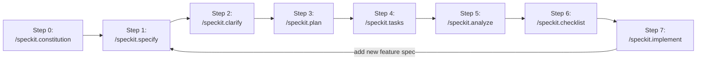

# `AGENTS.md` AI Agent Instruction File for the `mdxpad` codebase

> `mdxpad` is robust, performant, flexible, extensible, modern markup editor powered by `MDX`.

---

## Your Tools
NOTE: this is not an exhaustive list of your tools. make sure to always check for relevant tools as needed/appropriate/useful.

### Search Tools
NOTE: all of these tools are available to you as [MCP (model context protocol)](https://modelcontextprotocol.io/) servers/tools
- [`Tavily Search`](https://docs.tavily.com/documentation/mcp): smart AI context gathering search tool service
- [`Brave Search`](https://github.com/brave/brave-search-mcp-server): easy web search
- `fetch_urls` (from [`fetcher`](https://github.com/jae-jae/fetcher-mcp): robust multi-URL fetcher
- `fetch_html`, `fetch_json`, `fetch_txt`, `fetch_markdown` (from [`fetch`](https://github.com/zcaceres/fetch-mcp)): targeted content fetchers
- [`context7`](https://github.com/upstash/context7):  pulls up-to-date, version-specific documentation and code examples straight from the source — and places them directly into your prompt.
- [`deepwiki`](https://docs.devin.ai/work-with-devin/deepwiki-mcp): provides programmatic access to DeepWiki’s public repository documentation and search capabilities
- [`repomix`](https://repomix.com/guide/mcp-server): provides tools that enable AI assistants to package local or remote repositories for analysis without requiring manual file preparation.

### Thinking/Reasoning Methods
NOTE: THESE MCP SERVERS/TOOLS CAN BE USED INDIVIDUALLY OR COMBINED/ENSEMBLED AS NEEDED/APPROPRIATE/USEFUL TO MOST EFFECTIVELY SOLVE A GIVEN PROBLEM/REQUEST.
- [`sequential-thinking`](https://github.com/modelcontextprotocol/servers/tree/main/src/sequentialthinking): provides a tool for dynamic and reflective problem-solving through a structured thinking process
- [`atom-of-thoughts`](https://github.com/kbsooo/MCP_Atom_of_Thoughts): a decomposition-based reasoning framework.
- [`shannon-thinking`](https://github.com/olaservo/shannon-thinking): helps break down complex problems into structured thoughts following Shannon's approach of problem definition, mathematical modeling, and practical implementation.
- [`structured-thinking`](https://github.com/Promptly-Technologies-LLC/mcp-structured-thinking): motivation for this project is to allow LLMs to programmatically construct mind maps to explore an idea space, with enforced "metacognitive" self-reflection.
- [`crash`](https://github.com/nikkoxgonzales/crash-mcp): structured, iterative reasoning. CRASH helps AI assistants break down complex problems into trackable steps with confidence tracking, revision support, and branching for exploring alternatives.
- [`deep-lucid-3d`](https://github.com/MushroomFleet/DeepLucid3D-MCP): an implementation of the Unified Cognitive Processing Framework as an MCP server. It combines recursive self-awareness with dimensional knowledge categorization to provide a powerful approach to problem-solving and creative thinking.
- [`cascade-thinking`](https://github.com/drewdotpro/cascade-thinking-mcp): Transform linear problem-solving into rich, multi-dimensional exploration with true branching and intelligent thought management.): Transform linear problem-solving into rich, multi-dimensional exploration with true branching and intelligent thought management.
- [`lotus-wisdom`](https://github.com/linxule/lotus-wisdom-mcp):  provides a tool for problem-solving using the Lotus Sutra's wisdom framework, combining analytical thinking with intuitive wisdom.
- [`think-strategies`](https://github.com/aaronsb/think-strategies): provides a tool for dynamic and reflective problem-solving through structured thinking processes.
- [`creative-thinking`](https://github.com/uddhav/creative-thinking): implements 28 creative thinking techniques through a unified framework combining generative creativity with systematic risk assessment, analytical verification, and post-action reflexivity tracking.

---

## Codebase Development Methodology & Framework
- [`Spec-Driven Development` (**`SDD`**)](https://github.com/github/spec-kit/blob/main/spec-driven.md) is the primary development methodology/framework for this codebase.
- [`GitHub Spec Kit`](https://github.com/github/spec-kit/blob/main/README.md) (e.g. *`specify`* *cli*) orchestrates + manages **`SDD`** flows for all non-trivial features/enhancements/bug fixes.

### `spec-kit` dev flow

an AI dev agent uses [e.g. for ***Claude Code***: `.claude/commands/` `spec-kit` commands (e.g. `specify`, `clarify`, `plan`, `tasks`, `analyze`, `checklist`, `implement` etc)] to orchestrate + manage the dev flow for non-trivial features/enhancements/bug fixes in a new branch as per **`SDD`** methodology/framework:

In ***Claude Code***, batches of parallel, intelligently well-defined *subagents* are used to efficiently + robustly implement all of the tasks in the tasks list for each non-trivial feature/enhancement/bug fix. Flows of which are independent from each other enough are developed in parallel by separate claude code instances (each with its own iterative batches of parallel subagents) on different git worktrees/branches, and then merged together later.

---

## Your Rules
YOU MUST FOLLOW ALL OF THE RULES BELOW (7/7 total rules) AT ALL TIMES!!!
- use latest versions: always use the latest stable versions of any and all dependencies/libraries/packages/frameworks. use your `package version` and `context7` MCPs (and any others as useful) for help
- batch operations: always batch your tool calls (operations) where possible: MCP tools (e.g., `fetch_urls` [from the `fetcher` MCP] over repeated `fetch_url`), shell commands via brace expansion (`mkdir dir/{a,b,c}`), and similar parallelizable patterns.
- reuse existing logic: always check for existing logic/code snippets/utilities/libraries/packages that can be reused/extended to satisfy a request before creating new logic/code from scratch.
- web research first when uncertain: whenever uncertainty arises start by conducting deep, targeted web research to gather the latest information from authoritative sources using your MCP web tools (e.g Brave Search, Tavily Search, etc). if this additional web research does not elucidate the uncertainty, then succinctly interview the user to clarify the uncertainty before proceeding.
- maintain freshest info: whenever up-to-date information is useful/helpful/required, always use your MCP web tools (e.g Brave Search, Tavily Search, etc) to gather the latest information from authoritative sources.
- robustly use your subagents intelligently: always intelligently apply your subagents robustly whenever possible/appropriate/useful (in parallel within iterative batches).
- for any and all non-trivial requests, intelligently evaluate the available MCP tool thinking/reasoning methods and choose the best one(s) to use for the given request, then apply them appropriately.

---

## Active Technologies
- TypeScript 5.9.x with `strict: true` + @mdx-js/mdx 3.x, @mdx-js/react 3.x, React 19.x, Zustand 5.x, Immer 11.x, remark-gfm 4.x, remark-frontmatter 5.x, rehype-highlight 7.x, zod 4.x (003-preview-pane)
- N/A (in-memory state only; file I/O deferred to other specs) (003-preview-pane)
- TypeScript 5.9.x with `strict: true` (per Constitution Article II) + Electron 39.x, React 19.x, Zustand 5.x + Immer 11.x, CodeMirror 6.x, zod 4.x (005-command-palette)
- localStorage for recent commands and UI state persistence (005-command-palette)
- TypeScript 5.9.x, strict: true (per Constitution Article II) (014-smart-filtering)
- localStorage for filter query persistence per project/workspace (established pattern from specs 005/006) (014-smart-filtering)

## Recent Changes
- 003-preview-pane: Added TypeScript 5.9.x with `strict: true` + @mdx-js/mdx 3.x, @mdx-js/react 3.x, React 19.x, Zustand 5.x, Immer 11.x, remark-gfm 4.x, remark-frontmatter 5.x, rehype-highlight 7.x, zod 4.x
