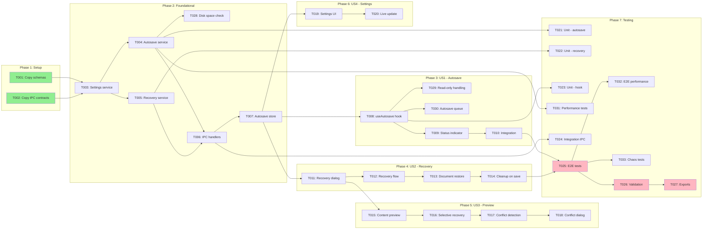

# Tasks: Autosave & Crash Recovery

**Feature**: `/specs/011-autosave-recovery/`
**Generated**: 2026-01-17
**Orchestration**: enabled

## Prerequisites

| Document | Status | Purpose |
|----------|--------|---------|
| plan.md | ✅ Ready | Tech stack, structure, dependencies |
| spec.md | ✅ Ready | 4 user stories (P1, P1, P2, P3) |
| data-model.md | ✅ Ready | RecoveryFile, RecoveryManifest, AutosaveSettings, AutosaveState |
| contracts/ | ✅ Ready | 10 IPC channels with zod schemas |
| research.md | ✅ Ready | Technical decisions, integration points |
| quickstart.md | ✅ Ready | Architecture diagram, testing strategy |

---

## Execution Constraints

```yaml
# Claude Code MAXIMUM POWER Config (Jan 2026 - Claude Max 20x)
# ⚡ SINGLE SESSION FULL THROTTLE - Token cost is not a concern ⚡

model: opus-4.5                    # Most capable model (slower but smarter)
max_parallel_subagents: 10         # Hard cap enforced by Claude Code
queue_overflow: true               # Tasks beyond 10 auto-queue, refill on complete

# Async/Background Agents (v2.0.60+)
async_background:
  enabled: true
  hotkey: Ctrl+B                   # Background running agents while continuing work
  wake_on_complete: true           # v2.0.64: agents wake main when done
  background_research: true        # Auto-background exploration/research tasks

# Timeouts (generous for Opus deep reasoning)
default_task_timeout: 10m
gate_timeout: 2m
subagent_timeout: 15m

# Fault Tolerance (high tolerance for complex tasks)
circuit_breaker:
  max_failures_per_batch: 5
  action: pause_and_report
retry_policy:
  max_attempts: 3
  backoff: exponential

# Subagent Dispatch Strategy
subagent_dispatch:
  strategy: greedy_queue           # Launch all 10 immediately, queue remainder
  refill_on_complete: true         # Start next queued task as soon as slot frees
  context_per_agent: 200k          # Each subagent gets full 200k context window
  extended_thinking: true          # Enable deep reasoning per agent
  ultrathink: complex              # Use ultrathink for architecture/design tasks

# Batch Optimization
batch_strategy:
  prefer_wider_batches: true       # More parallel tasks over deeper chains
  merge_small_batches: true        # Combine batches with <3 tasks when safe
  max_batch_size: 10               # Match hard cap for maximum throughput
```

---

## Quick Start

### Sequential Execution (Simple)

Execute tasks in order: T001 → T002 → T003 → ...

- Run gate validation after each phase completes
- Safe, predictable, no coordination needed

### Parallel Execution (Recommended) ⚡

1. **Greedy dispatch**: Spawn subagents for ALL tasks in current batch simultaneously
2. **Stream completions**: Process results as each subagent finishes (don't wait for slowest)
3. **Gate on batch complete**: Only run validation after ALL batch tasks finish
4. **Cascade immediately**: Start next batch's tasks the instant gate passes
5. **Cross-phase parallelism**: US1 and US2 are both P1 and can run concurrently after Foundational

---

## Phase 1: Setup

**Purpose**: Copy contracts from design artifacts to shared source
**Estimated Duration**: 5 minutes
**Max Parallelism**: 2 subagents

### Batch 1.1: Contracts Setup (parallel) ⚡

<!-- Context: specs/011-autosave-recovery/contracts/, src/shared/contracts/ -->
- [ ] T001 [P:1.1] Copy autosave-schemas.ts from specs/011-autosave-recovery/contracts/ to src/shared/contracts/autosave-schemas.ts
- [ ] T002 [P:1.1] Copy autosave-ipc.ts from specs/011-autosave-recovery/contracts/ to src/shared/contracts/autosave-ipc.ts

#### Gate 1.1: Contracts Validation

```bash
npx tsc --noEmit src/shared/contracts/autosave-schemas.ts src/shared/contracts/autosave-ipc.ts
```

**On-Fail**: Verify zod import paths; check existing type patterns in src/shared/contracts/

---

## Phase 2: Foundational

**Purpose**: Core main process services that ALL user stories depend on
**Estimated Duration**: 25-35 minutes
**Max Parallelism**: 3 subagents

⚠️ **BLOCKING**: No user story work can begin until this phase completes

### Batch 2.1: Settings Service (sequential)

<!-- Context: plan.md#services, data-model.md#AutosaveSettings, contracts/autosave-schemas.ts -->
- [ ] T003 [P:2.1] Implement AutosaveSettingsService in src/main/services/autosave-settings.ts (electron-store persistence, get/set settings, DEFAULT_AUTOSAVE_SETTINGS)

#### Gate 2.1: Settings Service Validation

```bash
npx tsc --noEmit src/main/services/autosave-settings.ts
```

**On-Fail**: Verify electron-store is available; check AutosaveSettingsSchema import

### Batch 2.2: Core Services (parallel) ⚡

<!-- Context: plan.md#services, data-model.md, contracts/, quickstart.md#architecture -->
- [ ] T004 [P:2.2] Implement AutosaveService in src/main/services/autosave-service.ts (atomic write pattern, checksum generation, manifest update, recovery file I/O)
- [ ] T005 [P:2.2] Implement RecoveryService in src/main/services/recovery-service.ts (startup check, manifest read, restore documents, discard logic, checksum validation per FR-019, retention cleanup per FR-021)
- [ ] T028 [P:2.2] Implement disk space check in AutosaveService: detect <100MB available before write, emit warning event, show notification per FR-017

#### Gate 2.2: Core Services Validation

```bash
npx tsc --noEmit src/main/services/autosave-service.ts src/main/services/recovery-service.ts
```

**On-Fail**: Check RecoveryFileSchema and RecoveryManifestSchema imports; verify fs/promises usage

### Batch 2.3: IPC Handlers

<!-- Context: contracts/autosave-ipc.ts, src/main/services/*.ts -->
- [ ] T006 [P:2.3] Implement IPC handlers in src/main/ipc/autosave-handlers.ts (register all 10 channels with zod validation, connect to services)

#### Gate 2.3: IPC Handlers Validation

```bash
npx tsc --noEmit src/main/ipc/autosave-handlers.ts
```

**On-Fail**: Verify AutosaveChannels import; check service dependency injection pattern

### Batch 2.4: Renderer Store

<!-- Context: plan.md#stores, data-model.md#AutosaveState, contracts/autosave-schemas.ts -->
- [ ] T007 [P:2.4] Implement autosave-store.ts in src/renderer/stores/autosave-store.ts (Zustand store for AutosaveStatus, settings cache, failure tracking)

#### Gate 2.4: Renderer Store Validation

```bash
npx tsc --noEmit src/renderer/stores/autosave-store.ts
```

**On-Fail**: Verify Zustand + Immer patterns match existing stores; check AutosaveStatusSchema import

**✓ Checkpoint**: Foundation ready — user story implementation can begin

---

## Phase 3: User Story 1 — Automatic Background Saving (Priority: P1) 🎯 MVP

**Goal**: Automatically save document content to recovery location at configurable intervals
**Independent Test**: Edit document → wait 30s → verify recovery file created in userData/recovery/
**Estimated Duration**: 20-30 minutes
**Max Parallelism**: 2 subagents

### Batch 3.1: Autosave Hook

<!-- Context: plan.md#hooks, src/renderer/stores/document-store.ts, contracts/autosave-ipc.ts -->
- [ ] T008 [P:3.1] [US1] Implement useAutosave hook in src/renderer/hooks/use-autosave.ts (subscribe to document store isDirty, debounce 2s, trigger IPC, track status)
- [ ] T029 [P:3.1] [US1] Handle read-only/locked documents in useAutosave: detect file permissions, skip autosave with visual indicator "Autosave unavailable: [reason]" per FR-018
- [ ] T030 [P:3.1] [US1] Implement autosave queue with in-progress guard: skip interval if previous save running, queue max 1 pending, show "Saving..." if >2s, emit slow-save warning after 2x interval per FR-020

#### Gate 3.1: Hook Validation

```bash
npx tsc --noEmit src/renderer/hooks/use-autosave.ts
```

**On-Fail**: Verify document store exports isDirty selector; check IPC invoke pattern

### Batch 3.2: Status Indicator

<!-- Context: contracts/autosave-schemas.ts#AutosaveStatus, src/renderer/stores/autosave-store.ts -->
- [ ] T009 [P:3.2] [US1] Implement AutosaveIndicator component in src/renderer/components/autosave-indicator.tsx (show saving/saved/failed states; 16x16px icon-only muted indicator; toast after 3 failures that auto-dismisses after 8s, includes "Retry Now" primary action and "Disable Autosave" secondary, persists on hover)

#### Gate 3.2: Indicator Validation

```bash
npx tsc --noEmit src/renderer/components/autosave-indicator.tsx
```

**On-Fail**: Verify AutosaveStatus type import; check toast notification integration

### Batch 3.3: Integration

<!-- Context: quickstart.md#phase1, src/main/main.ts, src/renderer/app.tsx -->
- [ ] T010 [P:3.3] [US1] Wire up autosave: register IPC handlers in main process startup, add useAutosave to editor component, add AutosaveIndicator to toolbar

#### Gate 3.3: US1 Integration Validation

```bash
npx tsc --noEmit && echo "Manual: Start app, make edit, wait 35s, check ~/Library/Application Support/mdxpad/recovery/"
```

**On-Fail**: Check IPC handler registration; verify hook is mounted in editor

**✓ Checkpoint**: User Story 1 complete — automatic background saving functional

---

## Phase 4: User Story 2 — Crash Recovery on Restart (Priority: P1) 🎯 MVP

**Goal**: Detect and restore unsaved work when application restarts after crash
**Independent Test**: Create recovery file manually → restart app → verify recovery dialog appears
**Estimated Duration**: 25-35 minutes
**Max Parallelism**: 2 subagents

### Batch 4.1: Recovery Dialog UI

<!-- Context: contracts/autosave-ipc.ts, data-model.md#RecoveryDialogEntry, quickstart.md#phase2 -->
- [ ] T011 [P:4.1] [US2] Implement RecoveryDialog component in src/renderer/components/recovery-dialog.tsx (list recoverable documents, accept/decline/dismiss buttons, keyboard navigation)

#### Gate 4.1: Dialog UI Validation

```bash
npx tsc --noEmit src/renderer/components/recovery-dialog.tsx
```

**On-Fail**: Verify RecoveryDialogEntrySchema import; check dialog/modal component pattern

### Batch 4.2: Recovery Flow Integration

<!-- Context: src/main/services/recovery-service.ts, src/renderer/stores/autosave-store.ts -->
- [ ] T012 [P:4.2] [US2] Implement startup recovery flow: check manifest on app ready, emit recovery-available event, show dialog, handle accept/decline/dismiss per FR-007
- [ ] T013 [P:4.2] [US2] Implement document restore logic: load recovery content, open in editor with isDirty=true, delete recovery file after successful restore

#### Gate 4.2: Recovery Flow Validation

```bash
npx tsc --noEmit && echo "Manual: Create test recovery file, restart app, verify dialog appears"
```

**On-Fail**: Check recovery service startup hook; verify document store integration

### Batch 4.3: Recovery Data Cleanup

<!-- Context: spec.md#FR-008, src/main/services/autosave-service.ts -->
- [ ] T014 [P:4.3] [US2] Implement recovery cleanup on manual save: when document is saved via File > Save, delete corresponding recovery file and update manifest

#### Gate 4.3: Cleanup Validation

```bash
npx tsc --noEmit && echo "Manual: Make edit, autosave triggers, then File > Save, verify recovery file deleted"
```

**On-Fail**: Check save action integration in document store or file service

**✓ Checkpoint**: User Story 2 complete — crash recovery on restart functional

---

## Phase 5: User Story 3 — Recovery Dialog with Preview (Priority: P2)

**Goal**: Allow users to preview recoverable content and selectively restore documents
**Independent Test**: Multiple recovery files → dialog shows all → select one → preview displays
**Estimated Duration**: 20-30 minutes
**Max Parallelism**: 2 subagents

### Batch 5.1: Preview Feature

<!-- Context: contracts/autosave-ipc.ts#RecoveryPreviewRequest, src/renderer/components/recovery-dialog.tsx -->
- [ ] T015 [P:5.1] [US3] Add content preview to RecoveryDialog: fetch full content on selection, render markdown preview, show file path and timestamp

#### Gate 5.1: Preview Validation

```bash
npx tsc --noEmit src/renderer/components/recovery-dialog.tsx
```

**On-Fail**: Check RecoveryPreviewResponse handling; verify preview render component

### Batch 5.2: Selective Recovery

<!-- Context: contracts/autosave-ipc.ts#RecoveryRestoreRequest, data-model.md#RecoveryDecision -->
- [ ] T016 [P:5.2] [US3] Implement selective recovery: checkbox per document, "Restore Selected" button, partial restore logic
- [ ] T017 [P:5.2] [US3] Implement conflict detection: compare disk mtime vs recovery timestamp, flag conflicts in dialog UI

#### Gate 5.2: Selective Recovery Validation

```bash
npx tsc --noEmit && echo "Manual: Multiple recovery files, select subset, restore, verify only selected restored"
```

**On-Fail**: Verify RecoveryDecision schema matches action types

### Batch 5.3: Conflict Resolution Dialog

<!-- Context: contracts/autosave-schemas.ts#FileConflict, spec.md#FR-016 -->
- [ ] T018 [P:5.3] [US3] Implement ConflictDialog component in src/renderer/components/conflict-dialog.tsx (diff view, choose recovery/disk/save-as options)

#### Gate 5.3: Conflict Dialog Validation

```bash
npx tsc --noEmit src/renderer/components/conflict-dialog.tsx
```

**On-Fail**: Check ConflictResolutionSchema import; verify diff view library integration

**✓ Checkpoint**: User Story 3 complete — preview and selective recovery functional

---

## Phase 6: User Story 4 — Autosave Configuration (Priority: P3)

**Goal**: Allow users to configure autosave interval and enable/disable functionality
**Independent Test**: Open settings → change interval → verify new interval takes effect immediately
**Estimated Duration**: 15-20 minutes
**Max Parallelism**: 2 subagents

### Batch 6.1: Settings UI

<!-- Context: contracts/autosave-ipc.ts#SettingsGet/Set, data-model.md#AutosaveSettings -->
- [ ] T019 [P:6.1] [US4] Add Autosave section to settings panel: interval slider (5s-30s per Constitution VII.3), enable/disable toggle, uses IPC to persist

#### Gate 6.1: Settings UI Validation

```bash
npx tsc --noEmit && echo "Manual: Open settings, see autosave section, change interval"
```

**On-Fail**: Check settings panel component location; verify SettingsSetRequest schema

### Batch 6.2: Live Settings Update

<!-- Context: spec.md#SC-005, src/renderer/hooks/use-autosave.ts -->
- [ ] T020 [P:6.2] [US4] Implement immediate effect: settings changes update autosave timer without restart, subscribe to settings changes in useAutosave hook

#### Gate 6.2: Live Update Validation

```bash
npx tsc --noEmit && echo "Manual: Change interval from 30s to 10s, verify next autosave at new interval"
```

**On-Fail**: Verify settings store subscription; check timer reset logic

**✓ Checkpoint**: User Story 4 complete — autosave configuration functional

---

## Phase 7: Testing & Polish

**Purpose**: Ensure all functionality works correctly with automated tests
**Estimated Duration**: 30-40 minutes
**Max Parallelism**: 3 subagents

### Batch 7.1: Unit Tests (parallel) ⚡

<!-- Context: tests/unit/, src/main/services/*.ts -->
- [ ] T021 [P:7.1] Write unit tests for AutosaveService in tests/unit/autosave-service.test.ts (atomic writes, checksum, manifest updates)
- [ ] T022 [P:7.1] Write unit tests for RecoveryService in tests/unit/recovery-service.test.ts (manifest parsing, restore logic, checksum validation, retention cleanup)
- [ ] T023 [P:7.1] Write unit tests for useAutosave hook in tests/unit/use-autosave.test.ts (debounce, IPC triggering, read-only detection, queue behavior)
- [ ] T031 [P:7.1] Add performance benchmark tests for autosave in tests/unit/autosave-performance.test.ts: measure main thread impact, assert <16ms blocking time, test with 1MB+ documents per SC-002

#### Gate 7.1: Unit Tests Pass

```bash
npx vitest run tests/unit/autosave-service.test.ts tests/unit/recovery-service.test.ts tests/unit/use-autosave.test.ts tests/unit/autosave-performance.test.ts
```

**On-Fail**: Review test assertions; check mock setup for fs and IPC

### Batch 7.2: Integration Tests

<!-- Context: tests/integration/, Constitution VI.4 -->
- [ ] T024 [P:7.2] Write IPC integration tests in tests/integration/autosave-ipc.test.ts. MUST test all 10 channels per Constitution VI.4: (1) mdxpad:recovery:check, (2) mdxpad:recovery:list, (3) mdxpad:recovery:preview, (4) mdxpad:recovery:restore, (5) mdxpad:recovery:discard, (6) mdxpad:autosave:trigger, (7) mdxpad:autosave:status, (8) mdxpad:settings:get, (9) mdxpad:settings:set, (10) mdxpad:conflict:resolve

#### Gate 7.2: Integration Tests Pass

```bash
npx vitest run tests/integration/autosave-ipc.test.ts
```

**On-Fail**: Verify IPC mock or real Electron test runner setup

### Batch 7.3: E2E Tests

<!-- Context: tests/e2e/, quickstart.md#testing-strategy -->
- [ ] T025 [P:7.3] Write E2E tests in tests/e2e/autosave-recovery.spec.ts (edit→autosave→verify, crash→restart→recovery dialog→restore, decline→verify deleted). Include SC-001 validation: verify recovery file contains 100% of autosaved content by comparing checksums.
- [ ] T032 [P:7.3] Add E2E performance test: measure time from app launch to recovery dialog render, assert <2000ms with 10 recovery files per SC-003
- [ ] T033 [P:7.3] Add chaos/adversarial E2E tests in tests/e2e/autosave-adversarial.spec.ts: kill process during save, corrupt manifest mid-write, simulate disk full, verify no data loss in each per SC-006

#### Gate 7.3: E2E Tests Pass

```bash
npx playwright test tests/e2e/autosave-recovery.spec.ts tests/e2e/autosave-adversarial.spec.ts
```

**On-Fail**: Check Playwright Electron setup; verify recovery directory access

### Batch 7.4: Final Polish

- [ ] T026 [P:7.4] Run quickstart.md validation scenarios, fix any issues found. Include SC-004 validation: time full recovery workflow with 5 documents, verify <30s total user interaction time.
- [ ] T027 [P:7.4] Update exports: add autosave schemas to src/shared/contracts/index.ts, add stores/hooks to renderer index. (Infrastructure task supporting all FRs via code organization - no direct FR mapping)

#### Gate 7.4: Final Validation

```bash
npx tsc --noEmit && npx vitest run && echo "All validations passed"
```

**On-Fail**: Address any remaining type errors or test failures

---

## Parallel Execution Summary

| Phase | Name | Batches | Tasks | Max Parallel | Critical Path | Independent |
|-------|------|---------|-------|--------------|---------------|-------------|
| 1 | Setup | 1 | 2 | 2 | T001 | No |
| 2 | Foundational | 4 | 6 | 3 | T003 → T004 → T006 → T007 | No |
| 3 | User Story 1 | 3 | 5 | 3 | T008 → T009 → T010 | **Yes** |
| 4 | User Story 2 | 3 | 4 | 2 | T011 → T012 → T014 | **Yes** |
| 5 | User Story 3 | 3 | 4 | 2 | T015 → T016 → T018 | No (needs US2) |
| 6 | User Story 4 | 2 | 2 | 1 | T019 → T020 | **Yes** |
| 7 | Testing & Polish | 4 | 10 | 4 | T021 → T024 → T025 → T026 | No |
| **Total** | | **20** | **33** | **10 (hard cap)** | **Critical: 8 tasks** | **Interleaved** |

### Parallelism Metrics

| Metric | Value | Notes |
|--------|-------|-------|
| **Total Tasks** | 33 | Sum of all tasks (6 new edge case/performance tasks) |
| **Critical Path Length** | 8 | T001 → T003 → T004 → T006 → T007 → T008 → T021 → T025 |
| **Parallelism Factor** | 4.1x | 33 tasks / 8 critical |
| **Max Concurrent Subagents** | **10** | Hard cap per Claude session |
| **Queue Overflow** | Unlimited | Tasks >10 auto-queue, greedy refill |
| **Theoretical Speedup** | 4.1x | With unlimited parallelism |
| **Practical Speedup** | 3.3x | With 10 slots + greedy refill |
| **Background Agents** | Ctrl+B | Research tasks can run async (v2.0.60+) |

### Cross-Phase Parallelism

After Phase 2 (Foundational) completes:
- **US1 (P1)** and **US2 (P1)** can run concurrently (both priority P1)
- **US4 (P3)** can run in parallel with US3 (no dependency)
- **US3 (P2)** should wait for US2 (builds on recovery dialog)

```
Phase 2 Complete (Foundational)
            ↓
    ┌───────┴───────┐
    ↓               ↓
Phase 3 (US1)   Phase 4 (US2)   ← Run in parallel (both P1)
    │               │
    └───────┬───────┘
            ↓
    ┌───────┴───────┐
    ↓               ↓
Phase 5 (US3)   Phase 6 (US4)   ← US3 needs US2, US4 independent
    │               │
    └───────┬───────┘
            ↓
    Phase 7 (Testing)
```

---

## Dependency Graph



**Legend**:
- Green (`#90EE90`): Tasks with no dependencies (can start immediately)
- Pink (`#FFB6C1`): Critical path tasks (end of longest chain)

---

## Dependencies

### Phase Dependencies

```
Phase 1 (Setup)
    ↓
Phase 2 (Foundational) ← BLOCKS ALL USER STORIES
    ↓
┌───────────────┬───────────────┐
↓               ↓               ↓
Phase 3 (US1)   Phase 4 (US2)   Phase 6 (US4)  ← Parallel after Phase 2
└───────┬───────┘               │
        ↓                       │
Phase 5 (US3) ◄─────────────────┘
        ↓
Phase 7 (Testing)
```

### User Story Independence

| Story | Can Start After | Dependencies on Other Stories |
|-------|-----------------|------------------------------|
| US1 | Phase 2 complete | None |
| US2 | Phase 2 complete | None |
| US3 | US2 complete | Uses RecoveryDialog from US2 |
| US4 | Phase 2 complete | None |

### Critical Path Analysis

```
T001 → T003 → T004 → T006 → T007 → T008 → T009 → T010
  ↑       ↑       ↑       ↑       ↑       ↑       ↑       ↑
Setup   Found.  Found.  Found.  Found.  US1     US1     US1
        Set'gs  Auto    IPC     Store   Hook    Indic.  Wire
```

**Bottleneck**: Foundational phase with 4 sequential batches

---

## Recovery Playbook

### Partial Batch Failure

**Symptoms**: Some tasks in batch succeed, others fail

**Recovery**:
1. Check gate output for specific failures
2. Review failed task error messages
3. Fix failing task(s) individually
4. Re-run only failed tasks, not entire batch
5. Re-run gate validation

### Gate Validation Failure

**Symptoms**: All tasks complete but gate fails

**Recovery**:
1. Read gate error output carefully
2. Common causes:
   - Import errors → missing dependency or typo in path
   - Type errors → run `npx tsc --noEmit {file}` for details
   - Missing file → task didn't create expected output
3. Fix identified issue
4. Re-run gate only: copy/paste gate command

### Corrupted State

**Symptoms**: Multiple cascading failures, unclear state

**Recovery**:
1. Identify last successful gate: `git log --oneline | grep speckit-gate`
2. Rollback: `git checkout speckit-gate-{batch_id}`
3. Re-run from failed batch

### Cross-Story Dependency Error

**Symptoms**: US3 fails because RecoveryDialog not ready

**Recovery**:
1. Complete US2 Phase 4 first
2. Then proceed with US3 Phase 5
3. This is a designed dependency (US3 extends US2 dialog)

---

## Common Issues

| Issue | Cause | Fix |
|-------|-------|-----|
| Schema import fails | Wrong path | Check src/shared/contracts/ |
| IPC handler not found | Not registered | Add to registerAutosaveHandlers() |
| Store not updating | Missing subscription | Verify Zustand selector usage |
| Recovery file not created | Wrong userData path | Check app.getPath('userData') |
| Dialog not showing | Event not emitted | Check recovery-available event |
| Conflict not detected | Missing mtime check | Verify lastKnownMtime comparison |

---

## Notes

- **[P:X.Y]** = Batch identifier; same ID means parallel-safe
- **[USn]** = User story label; helps track which story task belongs to
- **Gates** = Validation checkpoints; don't skip them
- **Checkpoints** = Safe stopping points; story is complete and testable
- Commit after each gate passes
- Each user story should work independently (except US3 needs US2)
- Stop at any checkpoint to validate incrementally
