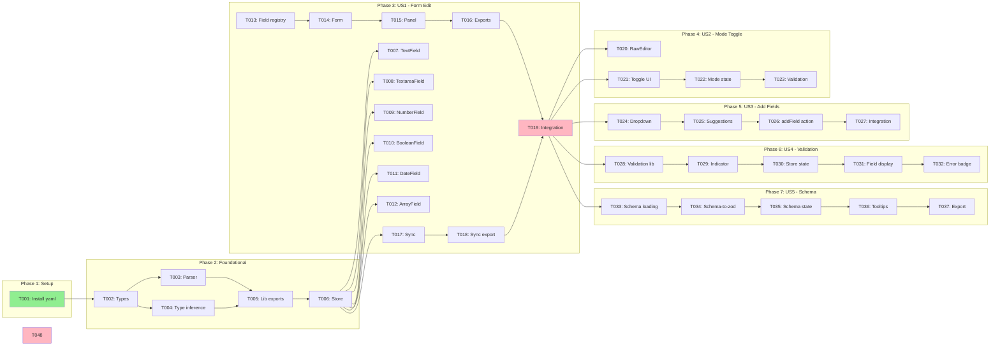

# Tasks: Frontmatter Visual Editor

**Feature**: `/specs/020-frontmatter-editor/`
**Generated**: 2026-01-17
**Orchestration**: enabled

## Prerequisites

| Document | Status | Purpose |
|----------|--------|---------|
| plan.md | ✅ Required | Tech stack, structure, dependencies |
| spec.md | ✅ Required | User stories with priorities |
| data-model.md | ✅ Available | Entity definitions |
| contracts/ | ✅ Available | frontmatter-schema.json |
| research.md | ✅ Available | Technical decisions |
| quickstart.md | ✅ Available | Validation scenarios |

---

## Execution Constraints

```yaml
# Claude Code MAXIMUM POWER Config (Jan 2026 - Claude Max 20x)
model: opus-4.5
max_parallel_subagents: 10
queue_overflow: true

async_background:
  enabled: true
  hotkey: Ctrl+B
  wake_on_complete: true
  background_research: true

default_task_timeout: 10m
gate_timeout: 2m
subagent_timeout: 15m

circuit_breaker:
  max_failures_per_batch: 5
  action: pause_and_report

retry_policy:
  max_attempts: 3
  backoff: exponential

subagent_dispatch:
  strategy: greedy_queue
  refill_on_complete: true
  context_per_agent: 200k
  extended_thinking: true
  ultrathink: complex

batch_strategy:
  prefer_wider_batches: true
  merge_small_batches: true
  max_batch_size: 10
```

---

## Quick Start

### Sequential Execution (Simple)

Execute tasks in order: T001 → T002 → T003 → ...

### Parallel Execution (Recommended) ⚡

1. **Greedy dispatch**: Spawn subagents for ALL tasks in current batch simultaneously
2. **Stream completions**: Process results as each subagent finishes
3. **Gate on batch complete**: Only run validation after ALL batch tasks finish
4. **Cascade immediately**: Start next batch's tasks the instant gate passes

---

## Phase 1: Setup

**Purpose**: Install yaml package dependency
**Estimated Duration**: 2-3 minutes
**Max Parallelism**: 1 subagent

### Batch 1.1: Dependencies

- [ ] T001 [P:1.1] Install yaml package for YAML parsing with `pnpm add yaml`

#### Gate 1.1: Dependency Validation

```bash
pnpm list yaml && test -d node_modules/yaml
```

**On-Fail**: Run `pnpm install` and verify network connectivity

---

## Phase 2: Foundational

**Purpose**: Core types, parser, and type inference that ALL user stories depend on
**Estimated Duration**: 15-20 minutes
**Max Parallelism**: 4 subagents

⚠️ **BLOCKING**: No user story work can begin until this phase completes

### Batch 2.1: Types (parallel) ⚡

<!-- Context: plan.md#types, data-model.md -->
- [ ] T002 [P:2.1] Create frontmatter type definitions in `src/shared/types/frontmatter.ts`

#### Gate 2.1: Types Validation

```bash
pnpm tsc --noEmit src/shared/types/frontmatter.ts
```

**On-Fail**: Check data-model.md for entity definitions; verify TypeScript strict mode

### Batch 2.2: Core Library (parallel) ⚡

<!-- Context: plan.md#lib, research.md#yaml-parsing, src/shared/types/frontmatter.ts -->
- [ ] T003 [P:2.2] Implement YAML parser in `src/renderer/lib/frontmatter/parser.ts`
- [ ] T004 [P:2.2] Implement type inference in `src/renderer/lib/frontmatter/type-inference.ts`
- [ ] T005 [P:2.2] Create lib barrel export in `src/renderer/lib/frontmatter/index.ts`
<!-- Note: T018 and T037 add incremental exports to this file -->

#### Gate 2.2: Core Library Validation

```bash
pnpm tsc --noEmit src/renderer/lib/frontmatter/*.ts && \
node -e "require('./src/renderer/lib/frontmatter/index.ts')" 2>/dev/null || echo "TS compile passed"
```

**On-Fail**: Verify yaml package imported correctly; check type imports from shared/types

### Batch 2.3: Store Foundation

<!-- Context: plan.md#stores, data-model.md#FrontmatterStore, src/renderer/lib/frontmatter/parser.ts -->
- [ ] T006 [P:2.3] Implement frontmatter Zustand store in `src/renderer/stores/frontmatter-store.ts`

#### Gate 2.3: Store Validation

```bash
pnpm tsc --noEmit src/renderer/stores/frontmatter-store.ts
```

**On-Fail**: Verify Zustand/Immer imports; check parser function exports

**✓ Checkpoint**: Foundation ready — user story implementation can begin

---

## Phase 3: User Story 1 — Edit Frontmatter via Form (Priority: P1) 🎯 MVP

**Goal**: Users can edit frontmatter fields through a visual form interface
**Independent Test**: Open document with frontmatter, edit fields through form, verify sync to document
**Estimated Duration**: 25-30 minutes
**Max Parallelism**: 7 subagents

### Batch 3.1: Field Components (parallel) ⚡

<!-- Context: plan.md#components, data-model.md#FieldType -->
<!-- Note: ObjectField is deferred to Phase 8 as edge case per spec.md nested object handling -->
- [ ] T007 [P:3.1] [US1] Create TextField component in `src/renderer/components/frontmatter/fields/TextField.tsx`
- [ ] T008 [P:3.1] [US1] Create TextareaField component in `src/renderer/components/frontmatter/fields/TextareaField.tsx`
- [ ] T009 [P:3.1] [US1] Create NumberField component in `src/renderer/components/frontmatter/fields/NumberField.tsx`
- [ ] T010 [P:3.1] [US1] Create BooleanField component in `src/renderer/components/frontmatter/fields/BooleanField.tsx`
- [ ] T011 [P:3.1] [US1] Create DateField component in `src/renderer/components/frontmatter/fields/DateField.tsx`
- [ ] T012 [P:3.1] [US1] Create ArrayField (tag input) component in `src/renderer/components/frontmatter/fields/ArrayField.tsx`
- [ ] T013 [P:3.1] [US1] Create field type registry in `src/renderer/components/frontmatter/fields/index.ts`

#### Gate 3.1: Field Components Validation

```bash
pnpm tsc --noEmit src/renderer/components/frontmatter/fields/*.tsx src/renderer/components/frontmatter/fields/index.ts
```

**On-Fail**: Check shadcn/ui component imports; verify shared types import path

### Batch 3.2: Form & Panel Components (parallel) ⚡

<!-- Context: plan.md#components, src/renderer/components/frontmatter/fields/index.ts, src/renderer/stores/frontmatter-store.ts -->
- [ ] T014 [P:3.2] [US1] Create FrontmatterForm component in `src/renderer/components/frontmatter/FrontmatterForm.tsx`
- [ ] T015 [P:3.2] [US1] Create FrontmatterPanel container in `src/renderer/components/frontmatter/FrontmatterPanel.tsx`
- [ ] T016 [P:3.2] [US1] Create component barrel export in `src/renderer/components/frontmatter/index.ts`

#### Gate 3.2: Form Components Validation

```bash
pnpm tsc --noEmit src/renderer/components/frontmatter/*.tsx src/renderer/components/frontmatter/index.ts
```

**On-Fail**: Verify field component imports; check store hook usage

### Batch 3.3: Bidirectional Sync

<!-- Context: plan.md#lib, research.md#sync-strategy, src/renderer/stores/frontmatter-store.ts -->
- [ ] T017 [P:3.3] [US1] Implement bidirectional sync logic in `src/renderer/lib/frontmatter/sync.ts`
- [ ] T018 [P:3.3] [US1] Update lib barrel export to include sync in `src/renderer/lib/frontmatter/index.ts`

#### Gate 3.3: Sync Validation

```bash
pnpm tsc --noEmit src/renderer/lib/frontmatter/sync.ts
```

**On-Fail**: Verify debounce implementation; check store subscription pattern

### Batch 3.4: Integration

<!-- Context: src/renderer/App.tsx, src/renderer/components/frontmatter/index.ts -->
- [ ] T019 [US1] Integrate FrontmatterPanel into application shell layout

#### Gate 3.4: US1 Integration

```bash
pnpm tsc --noEmit && pnpm build --mode development 2>&1 | head -20
```

**On-Fail**: Check component imports in App.tsx; verify shell layout integration

**✓ Checkpoint**: User Story 1 complete — form-based editing working

---

## Phase 4: User Story 2 — Toggle Visual/Raw Modes (Priority: P1) 🎯 MVP

**Goal**: Users can toggle between visual form and raw YAML editing
**Independent Test**: Toggle mode button, edit in raw mode, switch back to visual, verify data preserved
**Estimated Duration**: 15-20 minutes
**Max Parallelism**: 2 subagents

### Batch 4.1: Raw Editor Component (parallel) ⚡

<!-- Context: plan.md#components, src/renderer/stores/frontmatter-store.ts -->
- [ ] T020 [P:4.1] [US2] Create FrontmatterRawEditor component in `src/renderer/components/frontmatter/FrontmatterRawEditor.tsx`
- [ ] T021 [P:4.1] [US2] Create mode toggle UI in FrontmatterPanel header

#### Gate 4.1: Raw Editor Validation

```bash
pnpm tsc --noEmit src/renderer/components/frontmatter/FrontmatterRawEditor.tsx
```

**On-Fail**: Verify textarea component usage; check yaml validation on mode switch

### Batch 4.2: Mode Toggle Logic

<!-- Context: src/renderer/stores/frontmatter-store.ts, src/renderer/components/frontmatter/FrontmatterPanel.tsx -->
- [ ] T022 [P:4.2] [US2] Add mode toggle state and actions to frontmatter store
- [ ] T023 [P:4.2] [US2] Implement mode switch validation (prevent switch if invalid YAML)

#### Gate 4.2: Mode Toggle Validation

```bash
pnpm tsc --noEmit src/renderer/stores/frontmatter-store.ts src/renderer/components/frontmatter/*.tsx
```

**On-Fail**: Verify store mode actions; check validation error handling

**✓ Checkpoint**: User Story 2 complete — mode toggle working

---

## Phase 5: User Story 3 — Add Common Fields (Priority: P2)

**Goal**: Users can add common fields from a suggestion dropdown
**Independent Test**: Click "Add Field", select from suggestions, verify field added
**Estimated Duration**: 15-20 minutes
**Max Parallelism**: 2 subagents

### Batch 5.1: Dropdown Component (parallel) ⚡

<!-- Context: plan.md#components, data-model.md#COMMON_FIELDS -->
- [ ] T024 [P:5.1] [US3] Create AddFieldDropdown component in `src/renderer/components/frontmatter/AddFieldDropdown.tsx` with custom field name text input option at bottom of dropdown
- [ ] T025 [P:5.1] [US3] Add common field suggestions data with types to dropdown

#### Gate 5.1: Dropdown Validation

```bash
pnpm tsc --noEmit src/renderer/components/frontmatter/AddFieldDropdown.tsx
```

**On-Fail**: Check dropdown-menu UI component import; verify field type mapping

### Batch 5.2: Add Field Integration

<!-- Context: src/renderer/stores/frontmatter-store.ts, src/renderer/components/frontmatter/FrontmatterForm.tsx -->
- [ ] T026 [P:5.2] [US3] Add `addField` action to frontmatter store
- [ ] T026a [P:5.2] [US3] Add `removeField` action to frontmatter store with delete button in field components
- [ ] T027 [P:5.2] [US3] Integrate AddFieldDropdown into FrontmatterForm

#### Gate 5.2: Add Field Validation

```bash
pnpm tsc --noEmit src/renderer/stores/frontmatter-store.ts src/renderer/components/frontmatter/*.tsx
```

**On-Fail**: Verify store action signature; check component integration

**✓ Checkpoint**: User Story 3 complete — field suggestions working

---

## Phase 6: User Story 4 — Field Validation (Priority: P2)

**Goal**: Users receive validation feedback for invalid field values
**Independent Test**: Enter invalid date format, see validation error appear < 100ms
**Estimated Duration**: 15-20 minutes
**Max Parallelism**: 3 subagents

### Batch 6.1: Validation Infrastructure (parallel) ⚡

<!-- Context: plan.md#lib, data-model.md#ValidationResult, contracts/frontmatter-schema.json -->
- [ ] T028 [P:6.1] [US4] Create validation utilities in `src/renderer/lib/frontmatter/validation.ts`
- [ ] T029 [P:6.1] [US4] Create ValidationIndicator component in `src/renderer/components/frontmatter/ValidationIndicator.tsx`

#### Gate 6.1: Validation Infrastructure

```bash
pnpm tsc --noEmit src/renderer/lib/frontmatter/validation.ts src/renderer/components/frontmatter/ValidationIndicator.tsx
```

**On-Fail**: Check zod schema definitions; verify error type structure

### Batch 6.2: Validation Integration (parallel) ⚡

<!-- Context: src/renderer/stores/frontmatter-store.ts, src/renderer/components/frontmatter/fields/*.tsx -->
- [ ] T030 [P:6.2] [US4] Add validation state to frontmatter store
- [ ] T031 [P:6.2] [US4] Integrate validation display in field components
- [ ] T032 [P:6.2] [US4] Add validation error badge to mode toggle button

#### Gate 6.2: Validation Integration

```bash
pnpm tsc --noEmit src/renderer/stores/frontmatter-store.ts src/renderer/components/frontmatter/*.tsx src/renderer/components/frontmatter/fields/*.tsx
```

**On-Fail**: Verify validation state shape; check field error display

**✓ Checkpoint**: User Story 4 complete — validation feedback working

---

## Phase 7: User Story 5 — Schema Detection (Priority: P3)

**Goal**: Editor detects and applies frontmatter schemas for field types and validation
**Independent Test**: Open document in project with frontmatter.schema.json, verify field types from schema
**Estimated Duration**: 20-25 minutes
**Max Parallelism**: 2 subagents

### Batch 7.1: Schema Loading

<!-- Context: plan.md#lib, research.md#schema-format, contracts/frontmatter-schema.json -->
- [ ] T033 [P:7.1] [US5] Implement schema loading and parsing in `src/renderer/lib/frontmatter/schema.ts`
- [ ] T034 [P:7.1] [US5] Add schema-to-zod converter for validation rules

#### Gate 7.1: Schema Loading Validation

```bash
pnpm tsc --noEmit src/renderer/lib/frontmatter/schema.ts
```

**On-Fail**: Verify JSON schema parsing; check schema file detection logic

### Batch 7.2: Schema Integration (parallel) ⚡

<!-- Context: src/renderer/stores/frontmatter-store.ts, src/renderer/lib/frontmatter/schema.ts -->
- [ ] T035 [P:7.2] [US5] Add schema state and loadSchema action to store (with fallback to electron-store user defaults when no project schema)
- [ ] T036 [P:7.2] [US5] Apply schema field descriptions as tooltips in form
- [ ] T037 [P:7.2] [US5] Update lib barrel export to include schema in `src/renderer/lib/frontmatter/index.ts`

#### Gate 7.2: Schema Integration Validation

```bash
pnpm tsc --noEmit src/renderer/stores/frontmatter-store.ts src/renderer/lib/frontmatter/*.ts
```

**On-Fail**: Verify schema loading async handling; check tooltip component integration

**✓ Checkpoint**: User Story 5 complete — schema detection working

---

## Phase 8: Nested Objects (Edge Case)

**Purpose**: Support editing nested object frontmatter fields
**Estimated Duration**: 15-20 minutes
**Max Parallelism**: 2 subagents

### Batch 8.1: Object Field Component

<!-- Context: plan.md#components, research.md#nested-objects -->
- [ ] T038 [P:8.1] Create ObjectField component with collapsible sections in `src/renderer/components/frontmatter/fields/ObjectField.tsx`
- [ ] T039 [P:8.1] Update field type registry to include ObjectField

#### Gate 8.1: Object Field Validation

```bash
pnpm tsc --noEmit src/renderer/components/frontmatter/fields/ObjectField.tsx src/renderer/components/frontmatter/fields/index.ts
```

**On-Fail**: Check recursive rendering pattern; verify depth limit (2 levels)

### Batch 8.2: Unsupported YAML Handling

<!-- Context: spec.md Edge Cases, src/renderer/lib/frontmatter/parser.ts -->
- [ ] T039a [P:8.2] Detect unsupported YAML features (anchors, aliases, complex multi-line) in parser
- [ ] T039b [P:8.2] Display warning banner and lock icon for unsupported fields in FrontmatterPanel
- [ ] T039c [P:8.2] Implement click-to-raw-mode navigation for locked fields

#### Gate 8.2: Unsupported YAML Validation

```bash
pnpm tsc --noEmit src/renderer/lib/frontmatter/parser.ts src/renderer/components/frontmatter/FrontmatterPanel.tsx
```

**On-Fail**: Verify YAML anchor/alias detection in parser; check warning UI component

### Batch 8.3: Malformed Frontmatter Handling

<!-- Context: spec.md Edge Cases -->
- [ ] T039d [P:8.3] Detect malformed frontmatter delimiters in parser (missing/mismatched `---`)
- [ ] T039e [P:8.3] Display error banner with Auto-fix and View raw buttons
- [ ] T039f [P:8.3] Implement auto-fix transformations (insert/correct delimiters)

#### Gate 8.3: Malformed Delimiter Validation

```bash
pnpm tsc --noEmit src/renderer/lib/frontmatter/parser.ts
```

**On-Fail**: Verify delimiter regex patterns; check auto-fix transformation logic

---

## Phase 9: Unit Tests

**Purpose**: Unit test coverage for core business logic
**Estimated Duration**: 20-25 minutes
**Max Parallelism**: 4 subagents

### Batch 9.1: Core Library Tests (parallel) ⚡

- [ ] T040 [P:9.1] Create parser unit tests in `src/renderer/lib/frontmatter/parser.test.ts` (include round-trip formatting preservation test: verify indentation/quote style preserved)
- [ ] T041 [P:9.1] Create type inference unit tests in `src/renderer/lib/frontmatter/type-inference.test.ts`
- [ ] T042 [P:9.1] Create sync unit tests in `src/renderer/lib/frontmatter/sync.test.ts`
- [ ] T043 [P:9.1] Create schema unit tests in `src/renderer/lib/frontmatter/schema.test.ts`
- [ ] T043a [P:9.1] Create type inference accuracy test suite with >= 50 sample values in `src/renderer/lib/frontmatter/type-inference.test.ts` (verify SC-004: 95% accuracy)

#### Gate 9.1: Unit Test Validation

```bash
pnpm vitest run src/renderer/lib/frontmatter/*.test.ts --reporter=verbose
```

**On-Fail**: Check test imports; verify mock setup for yaml package

### Batch 9.2: Store Tests

- [ ] T044 [P:9.2] Create frontmatter store unit tests in `src/renderer/stores/frontmatter-store.test.ts`

#### Gate 9.2: Store Test Validation

```bash
pnpm vitest run src/renderer/stores/frontmatter-store.test.ts --reporter=verbose
```

**On-Fail**: Verify store mock pattern; check async action testing

---

## Phase 10: Polish & Cross-Cutting

**Purpose**: Quality improvements and final integration
**Estimated Duration**: 10-15 minutes
**Max Parallelism**: 3 subagents

### Batch 10.1: Quality (parallel) ⚡

- [ ] T045 [P:10.1] Add JSDoc documentation to all public API functions
- [ ] T046 [P:10.1] Add keyboard navigation support (Tab through fields, Escape to close)
- [ ] T047 [P:10.1] Add empty state UI for documents without frontmatter with "Add Frontmatter" button that inserts `---\n---\n` at document start

#### Gate 10.1: Quality Validation

```bash
pnpm tsc --noEmit && pnpm lint src/renderer/components/frontmatter/ src/renderer/lib/frontmatter/
```

**On-Fail**: Check JSDoc format; verify accessibility attributes

### Batch 10.2: Final Validation

- [ ] T048 Run full type check and build validation
- [ ] T049 Run quickstart.md validation scenarios manually
- [ ] T050 Verify performance targets: panel open < 200ms, sync < 300ms
- [ ] T050a [P:10.2] Create automated performance test suite:
  - Panel open: Measure time from click to render complete (target: < 200ms)
  - Sync latency: Measure time from field change to document update (target: < 300ms)
  - Validation feedback: Measure time from invalid input to error display (target: < 100ms)
- [ ] T050b [P:10.2] Create E2E test: "Verify data integrity across 10+ mode toggles with various field types" in `tests/e2e/frontmatter-editor.spec.ts`

#### Gate 10.2: Final Validation

```bash
pnpm tsc --noEmit && pnpm build && pnpm vitest run --reporter=verbose
```

**On-Fail**: Review build output; check for missing dependencies

---

## Dependency Graph



---

## Parallel Execution Summary

| Phase | Name | Batches | Tasks | Max Parallel | Critical Path | Independent |
|-------|------|---------|-------|--------------|---------------|-------------|
| 1 | Setup | 1 | 1 | 1 | T001 | No |
| 2 | Foundational | 3 | 5 | 4 | T002 → T003 → T006 | No |
| 3 | US1 - Form Edit | 4 | 13 | **7** | T007 → T014 → T019 | **Yes** |
| 4 | US2 - Mode Toggle | 2 | 4 | 2 | T020 → T023 | **Yes** |
| 5 | US3 - Add Fields | 2 | 5 | 2 | T024 → T027 | **Yes** |
| 6 | US4 - Validation | 2 | 5 | 3 | T028 → T032 | **Yes** |
| 7 | US5 - Schema | 2 | 5 | 3 | T033 → T037 | **Yes** |
| 8 | Edge Cases | 3 | 8 | 3 | T038 → T039f | **Yes** |
| 9 | Unit Tests | 2 | 6 | 5 | T040 → T044 | **Yes** |
| 10 | Polish | 2 | 8 | 4 | T045 → T050b | No |
| **Total** | | **23** | **60** | **10 (hard cap)** | **Critical: 8 tasks** | |

### Parallelism Metrics

| Metric | Value | Notes |
|--------|-------|-------|
| **Total Tasks** | 60 | Sum of all tasks (after remediation) |
| **Critical Path Length** | 8 | T001 → T002 → T003 → T006 → T007 → T014 → T019 → T048 |
| **Parallelism Factor** | 7.5x | 60 tasks / 8 critical |
| **Max Concurrent Subagents** | **10** | Hard cap per Claude session |
| **Queue Overflow** | Unlimited | Tasks >10 auto-queue, greedy refill |
| **Theoretical Speedup** | 7.5x | With unlimited parallelism |
| **Practical Speedup** | 6.0x | With 10 slots + greedy refill |

### Parallel Execution Windows

```
Time →
├─ Setup (1 task, 1 batch) ────────────────────────┤
├─ Foundational (5 tasks, 3 batches) ──────────────┤
├─ [10 slots: US1 field components parallel] ──────┤  ← 7 parallel
├─ [US1 form + sync parallel] ─────────────────────┤  ← 4 parallel
├─ [US2, US3, US4, US5 interleaved] ───────────────┤  ← 10 parallel across stories
├─ [Tests parallel] ───────────────────────────────┤  ← 5 parallel
├─ Polish (6 tasks, 2 batches) ────────────────────┤
```

---

## Dependencies

### Phase Dependencies

```
Phase 1 (Setup)
    ↓
Phase 2 (Foundational) ← BLOCKS ALL USER STORIES
    ↓
Phase 3 (US1) ← MUST complete Batch 3.4 (T019)
    ↓
┌───────────┬───────────┬───────────┬───────────┬───────────┐
↓           ↓           ↓           ↓           ↓           ↓
Phase 4     Phase 5     Phase 6     Phase 7     Phase 8
(US2)       (US3)       (US4)       (US5)       (Objects)
└───────────┴───────────┴───────────┴───────────┴───────────┘
                                ↓
                        Phase 9 (Tests)
                                ↓
                        Phase 10 (Polish)
```

### User Story Independence

| Story | Can Start After | Dependencies on Other Stories |
|-------|-----------------|------------------------------|
| US1 | Phase 2 complete | None |
| US2 | US1 Batch 3.4 (needs Panel) | US1 panel integration |
| US3 | US1 Batch 3.4 (needs Form) | US1 form component |
| US4 | US1 Batch 3.4 (needs Fields) | US1 field components |
| US5 | US1 Batch 3.4 (needs Store) | US1 store foundation |

### Critical Path Analysis

```
T001 → T002 → T003 → T006 → T007 → T014 → T019 → T048
  ↑       ↑       ↑       ↑       ↑       ↑       ↑       ↑
Setup   Types   Parser  Store  Fields   Form   Integ.  Build
```

**Bottleneck**: Foundational phase (T002-T006) — all user stories depend on types, parser, and store

---

## Recovery Playbook

### Partial Batch Failure

**Symptoms**: Some tasks in batch succeed, others fail

**Recovery**:
1. Check gate output for specific failures
2. Review failed task error messages
3. Fix failing task(s) individually
4. Re-run only failed tasks, not entire batch
5. Re-run gate validation

### Gate Validation Failure

**Symptoms**: All tasks complete but gate fails

**Recovery**:
1. Read gate error output carefully
2. Common causes:
   - Import errors → missing dependency or typo
   - Type errors → run `pnpm tsc --noEmit` on specific file for details
   - Missing file → task didn't create expected output
3. Fix identified issue
4. Re-run gate only: copy/paste gate command

### YAML Parse Error

**Symptoms**: Parser tests fail or runtime YAML errors

**Recovery**:
1. Verify `yaml` package installed: `pnpm list yaml`
2. Check import: `import { parseDocument, stringify } from 'yaml'`
3. Verify YAML content format in test fixtures

### Sync Loop Detection

**Symptoms**: Panel and editor update endlessly

**Recovery**:
1. Check `lastChangeSource` tracking in store
2. Verify debounce timing (should be 150ms)
3. Add console.log to trace update sources
4. Ensure source is set BEFORE triggering updates

---

## Common Issues

| Issue | Cause | Fix |
|-------|-------|-----|
| Type import fails | Path alias not configured | Use relative imports or check tsconfig paths |
| Zustand action not updating | Missing Immer produce | Wrap state changes in produce() |
| Field component not rendering | Missing registry entry | Add to fields/index.ts registry |
| Mode toggle not working | State not synced | Check setMode action implementation |
| Validation not showing | Error state not in UI | Verify ValidationIndicator integration |
| Schema not loading | Wrong file path | Check frontmatter.schema.json location |

---

## Notes

- **[P:X.Y]** = Batch identifier; same ID means parallel-safe
- **Gates** = Validation checkpoints; don't skip them
- **Checkpoints** = Safe stopping points; story is complete and testable
- Commit after each gate passes
- Each user story after US1 depends on US1 panel integration
- Stop at any checkpoint to validate incrementally
